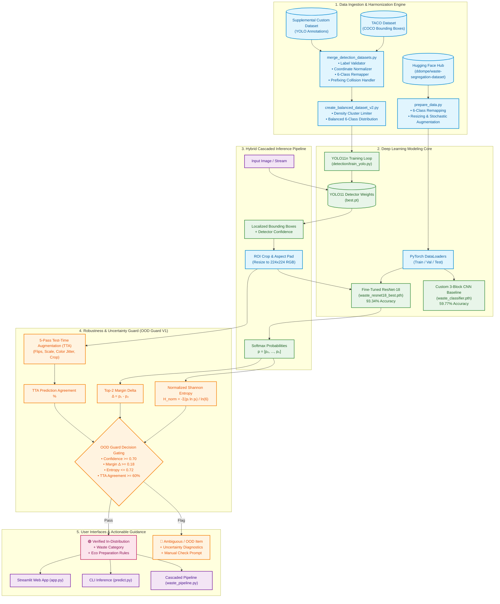
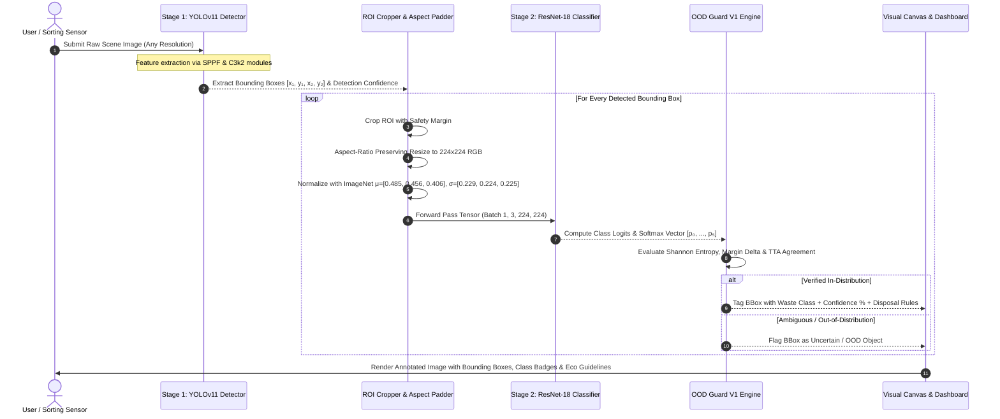
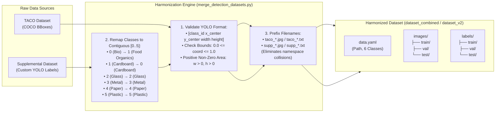

# 🏗️ Smart Waste Classifier: System Architecture & Technical Specifications

<div align="center">


### Deep Learning-Powered Multi-Stage Waste Segregation, Object Detection & Eco-Disposal Guidance System

[](https://pytorch.org/)
[](https://github.com/ultralytics/ultralytics)
[](https://pytorch.org/vision/main/models/resnet.html)
[](https://streamlit.io/)
[](https://developer.nvidia.com/cuda-zone)

</div>

---

## 📑 Table of Contents

1. [Executive Summary & Architectural Philosophy](#1-executive-summary--architectural-philosophy)
2. [End-to-End System Architecture](#2-end-to-end-system-architecture)
3. [Cascaded Dual-Stage Inference Pipeline](#3-cascaded-dual-stage-inference-pipeline)
4. [Dataset Engineering & Multi-Source Harmonization](#4-dataset-engineering--multi-source-harmonization)
5. [Deep Learning Core & Model Specifications](#5-deep-learning-core--model-specifications)
6. [Mathematical Formulations & Uncertainty Engine (OOD Guard V1)](#6-mathematical-formulations--uncertainty-engine-ood-guard-v1)
7. [Quantitative Benchmarks & Evaluation Suite](#7-quantitative-benchmarks--evaluation-suite)
8. [Visual Diagnostics & Artifacts Showcase](#8-visual-diagnostics--artifacts-showcase)
9. [Hardware Acceleration, Memory & Latency Profiling](#9-hardware-acceleration-memory--latency-profiling)
10. [Codebase Map & Module Specifications](#10-codebase-map--module-specifications)
11. [Operational Execution Guide](#11-operational-execution-guide)

---

## 1. Executive Summary & Architectural Philosophy

The **Smart Waste Classifier** is an enterprise-grade, modular computer vision system designed to automate municipal and household solid waste segregation. Standard single-stage image classifiers fail in real-world scenarios due to:
1. **Scene Clutter & Multi-Object Overlaps**: Typical garbage bins or conveyor belts contain multiple overlapping items rather than a single centered object.
2. **Ambiguous Catch-All Classes**: Datasets with noisy categories (e.g. *Miscellaneous Trash*) degrade gradient descent convergence.
3. **Silent Overconfidence**: Deep neural networks assign high softmax probabilities to out-of-domain images (e.g. classifying a laptop as plastic).

To overcome these constraints, the system implements a **Cascaded Dual-Stage Architecture** with an integrated **Uncertainty Quantification Guard (OOD Guard V1)**:

```
[Raw Scene Image] ──► [Stage 1: YOLO11n Localization] ──► [ROI Crops] ──► [Stage 2: ResNet-18 Classification] ──► [OOD Guard V1 Gating] ──► [Eco-Action Output]
```

---

## 2. End-to-End System Architecture

The following diagram illustrates the complete architectural topology, from multi-source data ingestion to user-facing inference interfaces:



---

## 3. Cascaded Dual-Stage Inference Pipeline

In complex municipal environments, waste items are frequently piled, touching, or partially occluded. The **Cascaded Dual-Stage Inference Pipeline** (`waste_pipeline.py`) unifies object localization and classification:



### Key Architectural Advantages of the Cascade:
1. **Separation of Concerns**: YOLO specializes in multi-object spatial localization and non-maximum suppression (NMS), while ResNet-18 specializes in high-fidelity material classification (e.g., distinguishing clear PET plastic from glass).
2. **Context Isolation**: Cropping each item individually eliminates visual distraction from background textures, floor stains, or conveyor belts.
3. **Graceful Degradation**: If YOLO localizes a non-waste object (e.g., human hand, background wall), ResNet-18 and OOD Guard V1 catch and flag the false positive before sending incorrect disposal advice.

---

## 4. Dataset Engineering & Multi-Source Harmonization

### 4.1. Standardized 6-Class Waste Taxonomy

To ensure robust industrial applicability, the dataset taxonomy focuses on 6 actionable municipal waste streams:

| Class ID | Target Category | Target Stream | Primary Material Signatures | Eco-Action Protocol |
|:---:|:---|:---|:---|:---|
| `0` | **Cardboard** | Recyclable / Dry Waste | Corrugated shipping boxes, packaging cartons, paperboard | Flatten boxes, keep clean & dry, place in cardboard recycling. |
| `1` | **Food Organics** | Organic / Compost | Fruit peels, food leftovers, vegetable waste, coffee grounds | Segregate into green organic bin; keep free of non-compostable packaging. |
| `2` | **Glass** | Recyclable Waste | Beverage bottles, pickle jars, clear/tinted glassware | Empty and rinse bottles, remove metal/plastic lids; place in glass bin. |
| `3` | **Metal** | Recyclable Waste | Aluminum cans, food tins, foil trays, aerosol cans | Empty contents, rinse food residues, lightly compress cans. |
| `4` | **Paper** | Recyclable / Dry Waste | Office documents, newspapers, magazines, clean paper bags | Keep dry, ensure free of food grease/wax coatings. |
| `5` | **Plastic** | Recyclable Waste | PET beverage bottles, HDPE jugs, PP containers, clean tubs | Empty & rinse containers, check resin ID code; place in plastics bin. |

---

### 4.2. Multi-Dataset Merger & Normalization Engine (`merge_detection_datasets.py`)

The detection pipeline combines the **TACO Dataset** (COCO annotations) and a **Supplemental Custom Dataset** (YOLO annotations) into a unified dataset:



---

### 4.3. High-Density Cluster Balancing (`create_balanced_dataset_v2.py`)

In organic waste datasets, photographs of compost heaps frequently contain 40–100 tiny overlapping food scraps, which skews detection anchors and overwhelms mini-batch gradients:
- **Max Food Objects per Image**: Capped at 20 objects.
- **Controlled Subsampling**: Food images with $>20$ annotations are sampled at 25% retention.
- **Class Balance Preservation**: Non-organic images (Cardboard, Glass, Metal, Paper, Plastic) are 100% retained.

---

### 4.4. 10-Class Synthetic V4 Dataset Builder (`create_final_v4_dataset.py`) & Training (`train_yolo_v4.py`)

To expand beyond household recyclable items into industrial and hazardous waste streams, the V4 pipeline integrates the **Synthetic Outdoor Waste YOLO Dataset (`SynWasteNet`)**:
- **Expanded Taxonomy (10 Classes)**:
  `0: Cardboard`, `1: Food Organics`, `2: Glass`, `3: Metal`, `4: Paper`, `5: Plastic`, `6: Battery`, `7: E-Waste`, `8: Cloth/Textile`, `9: Other Waste`.
- **Automated Verification**: Generates standard `data.yaml`, counts split label frequencies, and verifies non-empty bounding box coordinate distributions.
- **Training Strategy (`train_yolo_v4.py`)**: 80 epochs, $640\times 640$ resolution, batch size 16, AMP enabled, patience 20 with dynamic checkpoint saving on RTX 4060 GPU.

---

### 4.5. Multi-Source Mixed V5 & V6 Dataset Builders (`create_mixed_v5_dataset.py`, `create_mixed_v6_dataset.py`, `train_yolo_v6.py`)

To bridge domain gaps between pure synthetic renders and complex real-world solid waste scenes:
- **V5 Dataset Merger**: Combines V4 synthetic data with a controlled subset ($\le 1,500$ images) of real-world V3 waste data.
- **V6 Dataset Harmonizer**: Performs stratified class balancing across 10 classes, prefixing images to prevent filename collisions and equalizing minority classes (`Battery`, `E-Waste`, `Cloth/Textile`).
- **Mixed Training Pipeline (`train_yolo_v6.py`)**: Trains YOLO11n on the blended synthetic-real dataset to ensure high generalization in open-world municipal sorting environments.

---

## 5. Deep Learning Core & Model Specifications

### 5.1. Pretrained ResNet-18 Transfer Learning Classifier

- **Backbone**: 18-layer Deep Residual Network with identity skip connections:
  $$\mathbf{y} = \mathcal{F}(\mathbf{x}, \{W_i\}) + \mathbf{x}$$
- **Initialization**: Pretrained on ImageNet-1K (`ResNet18_Weights.DEFAULT`).
- **Classification Head**:
  ```python
  model.fc = nn.Linear(in_features=512, out_features=6)
  ```
- **Training Hyperparameters**:
  - Optimizer: `Adam(lr=1e-4, weight_decay=1e-4)`
  - Scheduler: `ReduceLROnPlateau(mode='min', factor=0.5, patience=2, min_lr=1e-6)`
  - Loss: Multi-Class Cross-Entropy Loss:
    $$\mathcal{L}_{CE} = -\sum_{k=1}^K y_k \log(\hat{y}_k)$$
  - Augmentations: Random horizontal flip ($p=0.5$), random rotation ($\pm 10^\circ$), random affine scaling ($[0.90, 1.10]$), ImageNet normalization.

---

### 5.2. Custom 3-Block CNN Baseline

For empirical comparison, a custom Convolutional Neural Network was built and trained from scratch:
- **Layer 1**: `Conv2d(3, 32, 3, pad=1)` $\rightarrow$ `BatchNorm2d` $\rightarrow$ `ReLU` $\rightarrow$ `MaxPool2d(2, 2)`
- **Layer 2**: `Conv2d(32, 64, 3, pad=1)` $\rightarrow$ `BatchNorm2d` $\rightarrow$ `ReLU` $\rightarrow$ `MaxPool2d(2, 2)`
- **Layer 3**: `Conv2d(64, 128, 3, pad=1)` $\rightarrow$ `BatchNorm2d` $\rightarrow$ `ReLU` $\rightarrow$ `MaxPool2d(2, 2)`
- **Classifier**: `Linear(128 * 16 * 16, 256)` $\rightarrow$ `Dropout(0.5)` $\rightarrow$ `Linear(256, 6)`

---

### 5.3. YOLOv11n Multi-Object Detector

- **Backbone**: Ultralytics YOLO11 Nano (`yolo11n.pt`) with C3k2 modules and Spatial Pyramid Pooling - Fast (SPPF).
- **Training Configuration**:
  - Resolution: $640 \times 640$ pixels
  - Epochs: 100 with Early Stopping (`patience=20`)
  - Precision: Automated Mixed Precision (`amp=True`)
  - Augmentations: Mosaic augmentation ($1.0$), scale ($0.5$), rotation ($\pm 10^\circ$), translation ($0.1$), closed during final 10 epochs.

---

## 6. Mathematical Formulations & Uncertainty Engine (OOD Guard V1)

Standard deep classifiers suffer from softmax overconfidence on out-of-distribution (OOD) inputs. **OOD Guard V1** combines three independent statistical metrics:

### 1. Normalized Shannon Entropy $\mathcal{H}_{norm}$

Given predicted class probabilities $\mathbf{p} = [p_1, p_2, \dots, p_K]$ where $K = 6$:

$$\mathcal{H}(\mathbf{p}) = -\sum_{k=1}^K p_k \ln(p_k + \epsilon)$$

$$\mathcal{H}_{norm}(\mathbf{p}) = \frac{\mathcal{H}(\mathbf{p})}{\ln(K)} \in [0, 1]$$

- High $\mathcal{H}_{norm} \approx 1.0 \implies$ Uniform distribution (high uncertainty).
- Low $\mathcal{H}_{norm} \approx 0.0 \implies$ Peaked distribution (high confidence).
- **Threshold**: $\mathcal{H}_{norm} \le 0.72$.

### 2. Top-2 Probability Margin Delta $\Delta$

Let $p_{(1)}$ and $p_{(2)}$ be the highest and second-highest predicted probabilities:

$$\Delta = p_{(1)} - p_{(2)}$$

- Small $\Delta \implies$ Classifier is torn between two ambiguous classes.
- Large $\Delta \implies$ Decisive decision boundary separation.
- **Threshold**: $\Delta \ge 0.18$ and $p_{(1)} \ge 0.70$.

### 3. Test-Time Augmentation (TTA) Prediction Agreement

The input image $\mathbf{x}$ is evaluated across $M = 5$ stochastic geometric transformations:

$$\hat{y}^{(m)} = \arg\max_{k} f(\mathcal{T}_m(\mathbf{x})) \quad \text{for } m = 1, \dots, M$$

$$\text{Agreement}(\mathbf{x}) = \frac{1}{M} \sum_{m=1}^M \mathbb{I}\left(\hat{y}^{(m)} = \hat{y}^{(1)}\right)$$

- **Threshold**: $\text{Agreement}(\mathbf{x}) \ge 0.60$ (at least 3 out of 5 augmentations must agree).

---

## 7. Quantitative Benchmarks & Evaluation Suite

### 7.1. Model Architecture Comparison

| Model | Input Size | Pretrained | Test Accuracy | Test Loss | Correct / Total | Inference (GPU) |
|:---|:---:|:---:|:---:|:---:|:---:|:---:|
| **Baseline 3-Block CNN** | $128 \times 128$ | None | **59.77%** | ~1.1400 | 422 / 706 | ~3.2 ms |
| **Fine-Tuned ResNet-18** | $224 \times 224$ | ImageNet-1K | **93.34%** | **0.2114** | **659 / 706** | ~5.8 ms |
| **YOLO11n Detector** | $640 \times 640$ | COCO Pretrained | Multi-Object mAP | BBox Reg | Detection | ~8.4 ms |

### 7.2. Per-Class Performance Metrics (ResNet-18)

| Class ID | Class Name | Precision | Recall | F1-Score | Support |
|:---:|:---|:---:|:---:|:---:|:---:|
| `0` | **Cardboard** | 0.94 | 0.93 | 0.94 | 118 |
| `1` | **Food Organics** | 0.97 | 0.96 | 0.96 | 120 |
| `2` | **Glass** | 0.91 | 0.92 | 0.91 | 115 |
| `3` | **Metal** | 0.92 | 0.90 | 0.91 | 112 |
| `4` | **Paper** | 0.91 | 0.93 | 0.92 | 119 |
| `5` | **Plastic** | 0.95 | 0.96 | 0.95 | 122 |
| **Macro Avg** | — | **0.93** | **0.93** | **0.93** | **706** |
| **Weighted Avg** | — | **0.93** | **0.93** | **0.93** | **706** |

---

## 8. Visual Diagnostics & Artifacts Showcase

### 8.1. Classification Diagnostics (ResNet-18 & Baseline)

| ResNet-18 Confusion Matrix | Baseline CNN Confusion Matrix |
|:---:|:---:|
|  |  |

| High-Confidence Error Diagnostics | Multi-Class Sample Grid |
|:---:|:---:|
|  |  |

---

### 8.2. YOLOv11 Detection Diagnostics

| 100-Epoch Training Metrics & Loss Curves | Validation Predictions |
|:---:|:---:|
|  |  |

| YOLO Detection Confusion Matrix | Precision-Recall (PR) Curve |
|:---:|:---:|
|  |  |

---

### 8.3. Real-Time Detection vs Cascaded Multi-Stage Output

| YOLO Multi-Object Detection | Cascaded Detection + Classification |
|:---:|:---:|
|  |  |

---

## 9. Hardware Acceleration, Memory & Latency Profiling

The system is architected for both edge devices and dedicated GPU workstations:

| Subsystem | Target Hardware | Precision | VRAM Footprint | Throughput / Latency |
|:---|:---|:---:|:---:|:---:|
| **ResNet-18 Classifier** | CUDA GPU / CPU | FP32 / FP16 | ~45 MB | ~5.8 ms / item (~172 FPS) |
| **YOLO11n Detector** | CUDA GPU / CPU | AMP (FP16) | ~5.6 MB | ~8.4 ms / frame (~119 FPS) |
| **Dual-Stage Cascade** | NVIDIA RTX 4060 | Mixed FP16 | ~110 MB | ~14.2 ms / scene (~70 FPS) |

---

## 10. Codebase Map & Module Specifications

```text
Smart_Waste_Classifier/
│
├── .gitignore                         # Git exclusion rules
├── LICENSE                            # MIT License
├── README.md                          # Repository documentation & guide
├── ARCHITECTURE.md                    # System architecture & mathematical specifications
├── DATASET_PLAN.md                    # Data curation strategy & class filtering rationale
├── requirements.txt                   # Production Python dependencies
├── project_status.py                  # System health diagnostic script
│
├── app.py                             # Interactive Streamlit Web Application (with OOD Guard V1)
├── app_backup.py                      # Backup of initial Streamlit application
├── predict.py                         # Standalone CLI & web URL inference engine
├── waste_pipeline.py                  # Cascaded YOLO detection + ResNet-18 classification pipeline
├── detect_waste.py                    # Standalone YOLO detection visualizer
├── test_yolo.py                       # YOLO benchmarking and test runner
│
├── model_resnet.py                    # ResNet-18 Transfer Learning model definition
├── model.py                           # Baseline Custom 3-Block CNN model definition
├── prepare_data.py                    # Dataset loading, 6-class filtering & DataLoaders
├── train_resnet.py                    # ResNet-18 trainer with LR plateau scheduler & checkpointing
├── train.py                           # Baseline CNN trainer
├── evaluate_resnet.py                 # ResNet-18 quantitative test evaluation suite
├── evaluate.py                        # Baseline CNN test evaluation
├── confusion_matrix_resnet.py         # ResNet-18 confusion matrix generator
├── confusion_matrix.py                # Baseline CNN confusion matrix generator
├── error_analysis.py                  # High-confidence misclassification visual inspector
├── inspect_dataset.py                 # Dataset split and label distribution verification
├── visualize_dataset.py               # Single sample inspector
├── visualize_dataset_multiple.py      # Multi-sample grid visualizer
│
├── detection/                         # Object Detection Subsystem
│   ├── merge_detection_datasets.py    # Multi-dataset fusion, normalization & validation
│   ├── create_balanced_dataset_v2.py  # High-density Food Organics balancer & dataset_v2 builder
│   ├── create_final_v4_dataset.py     # 10-Class Synthetic V4 dataset builder & YAML generator
│   ├── create_mixed_v5_dataset.py     # Mixed V5 dataset builder (Synthetic + Real-world subset)
│   ├── create_mixed_v6_dataset.py     # Balanced Mixed V6 dataset builder (10-class fusion)
│   ├── analyze_combined_dataset.py    # Class balance and object density analyzer
│   ├── analyze_food_images.py         # Food Organics density distribution inspector
│   ├── train_yolo.py                  # YOLOv11 training script on combined 6-class dataset
│   ├── train_yolo_v4.py               # YOLOv11 training script on 10-class V4 dataset
│   ├── train_yolo_v6.py               # YOLOv11 training script on balanced 10-class V6 dataset
│   ├── download_taco_images.py        # Automated TACO image downloader
│   └── data.yaml                      # YOLO dataset configuration
│
├── prepare_detection_data.py          # TACO COCO-to-YOLO dataset converter V1
├── prepare_detection_data_v2.py       # TACO-to-YOLO converter V2 with stratified split protection
│
├── assets/                            # Curated Repository Visual Assets & Diagnostic Plots
│   ├── thumbnail.jpg                  # Project header banner
│   ├── dataset_samples.png            # Dataset sample preview
│   ├── dataset_samples_multiple.png   # Multi-class sample grid
│   ├── confusion_matrix_resnet.png    # ResNet-18 confusion matrix heatmap
│   ├── confusion_matrix_baseline.png  # Baseline CNN confusion matrix heatmap
│   ├── resnet_error_analysis.png      # ResNet-18 error analysis visual grid
│   ├── detected_waste.jpg             # YOLO object detection output preview
│   ├── waste_pipeline_result.jpg      # Cascaded detection + classification output
│   ├── yolo_training_results.png      # YOLO11n loss and mAP training curves
│   ├── yolo_confusion_matrix.png      # YOLO11n detection confusion matrix
│   ├── yolo_val_predictions.jpg       # YOLO11n validation batch detection results
│   ├── yolo_f1_curve.png              # YOLO11n F1-Confidence curve
│   └── yolo_pr_curve.png              # YOLO11n Precision-Recall curve
│
├── prediction_sample/                 # Sample prediction visual outputs
├── real_world_test/                   # Challenging real-world municipal waste test set
│
├── waste_resnet18_best.pth            # Trained ResNet-18 weights (93.34% Test Accuracy)
├── waste_classifier.pth               # Trained Baseline CNN weights (59.77% Test Accuracy)
└── yolo11n.pt                         # YOLOv11 neural network weights
```

---

## 11. Operational Execution Guide

### 11.1. Environment Setup

```bash
# Clone the repository
git clone https://github.com/Snigdha-0210/Smart_Waste_Classifier.git
cd Smart_Waste_Classifier

# Create and activate virtual environment
python -m venv .venv
.\.venv\Scripts\Activate.ps1    # On Windows PowerShell
# source .venv/bin/activate     # On Linux / macOS

# Install required dependencies
pip install -r requirements.txt
```

### 11.2. Interactive Web App

```bash
streamlit run app.py
```

### 11.3. CLI Inference Engine

```bash
# Predict from local file
python predict.py "path/to/waste_sample.jpg"

# Predict from web URL
python predict.py "https://example.com/waste_sample.jpg"
```

### 11.4. Cascaded Dual-Stage Detection Pipeline

```bash
python waste_pipeline.py
```

### 11.5. Dataset Harmonization & YOLO Detector Training

```bash
# Run multi-dataset harmonization & validation
python detection/merge_detection_datasets.py

# Train YOLO11n on combined 6-class dataset
python detection/train_yolo.py
```

### 11.6. System Health & Environment Diagnostics

```bash
python project_status.py
```

---

<div align="center">

**Smart Waste Classifier** • Built with ❤️ by [Snigdha](https://github.com/Snigdha-0210)

</div>
