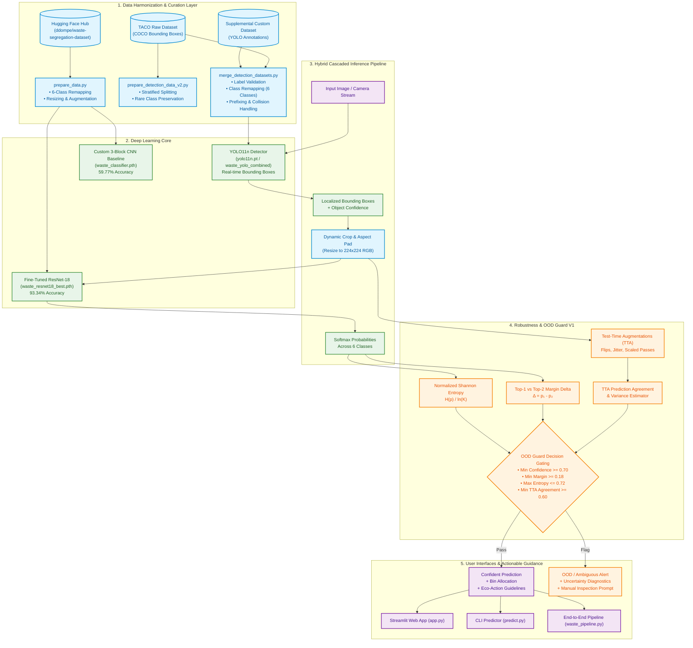
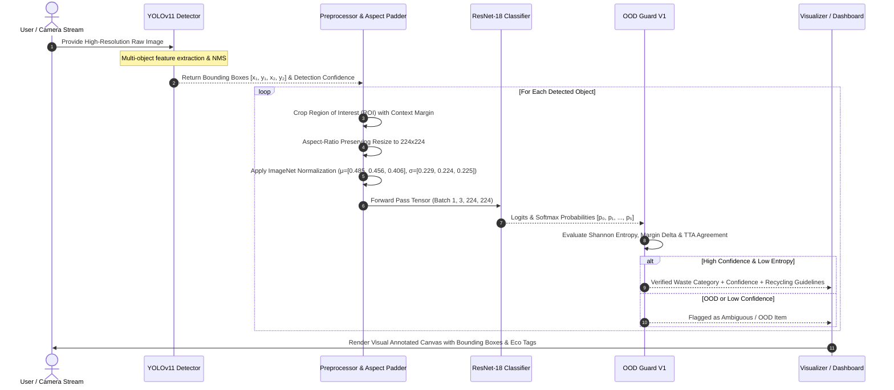
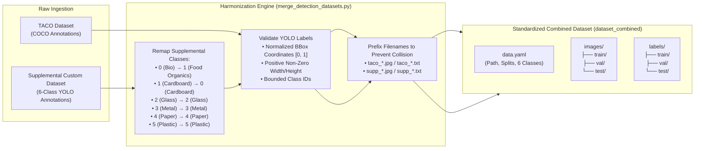
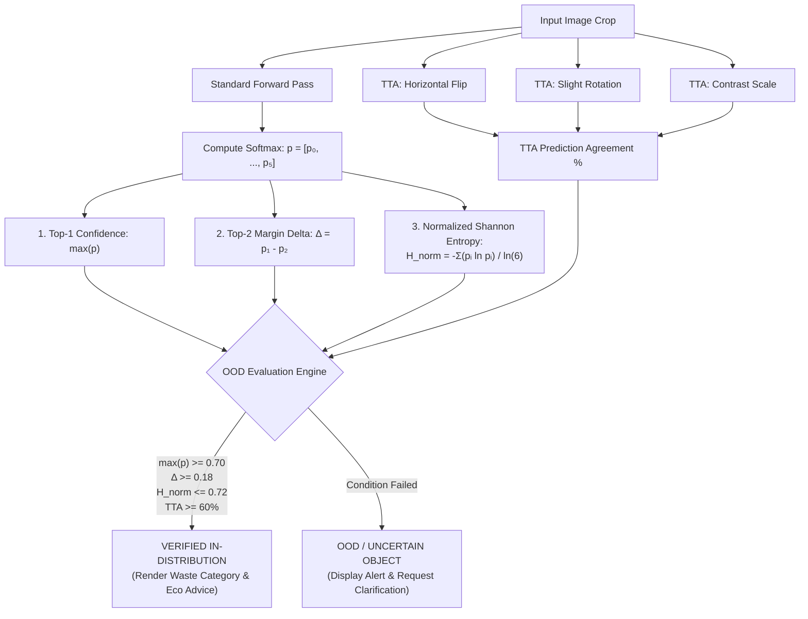
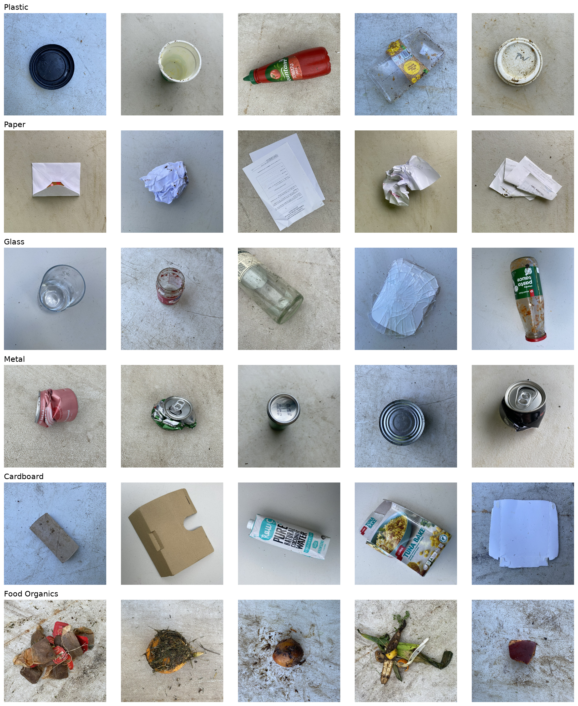
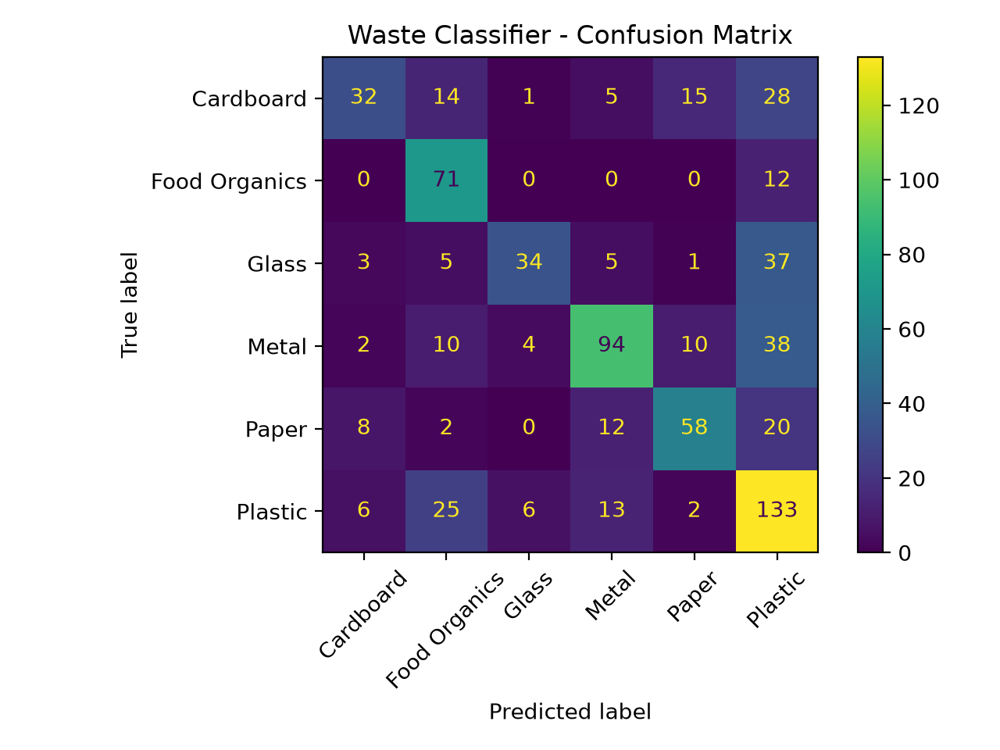
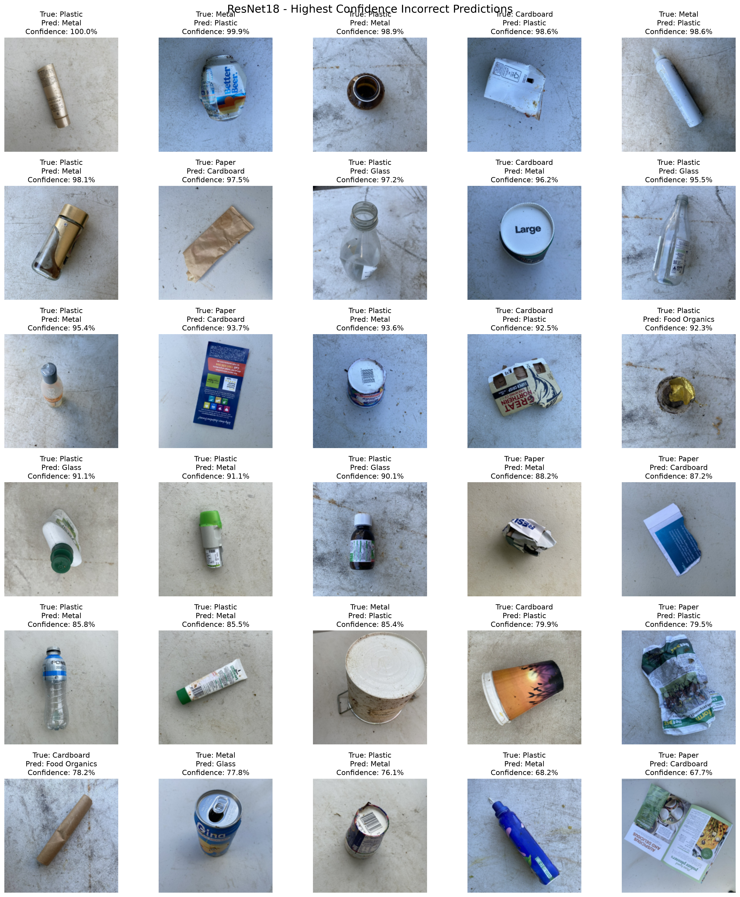
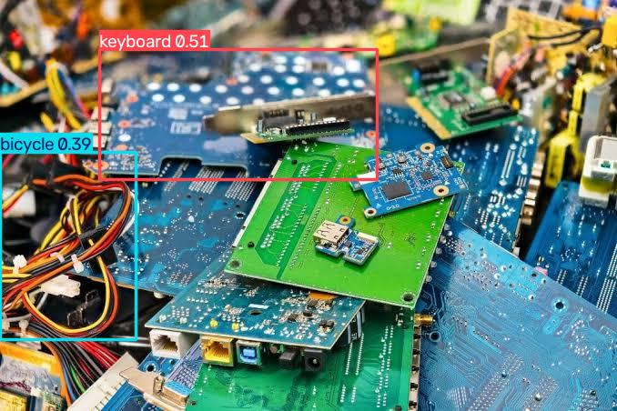

# 🏗️ Smart Waste Classifier: System Architecture & Technical Specifications

<div align="center">


### Deep Learning-Powered Multi-Stage Waste Segregation, Object Detection & Eco-Disposal Guidance

[](https://pytorch.org/)
[](https://github.com/ultralytics/ultralytics)
[](https://pytorch.org/vision/main/models/resnet.html)
[](https://streamlit.io/)
[](https://developer.nvidia.com/cuda-zone)

</div>

---

## 📑 Table of Contents

1. [System Overview & High-Level Architecture](#1-system-overview--high-level-architecture)
2. [End-to-End Hybrid Detection + Classification Pipeline](#2-end-to-end-hybrid-detection--classification-pipeline)
3. [Dataset Engineering & Multi-Dataset Harmonization](#3-dataset-engineering--multi-dataset-harmonization)
4. [Model Architectures & Training Protocols](#4-model-architectures--training-protocols)
5. [OOD Guard V1: Uncertainty & Out-of-Distribution Engine](#5-ood-guard-v1-uncertainty--out-of-distribution-engine)
6. [Quantitative Benchmarks & Evaluation Suite](#6-quantitative-benchmarks--evaluation-suite)
7. [Visual Artifacts & Diagnostics Showcase](#7-visual-artifacts--diagnostics-showcase)
8. [Codebase Map & Module Specifications](#8-codebase-map--module-specifications)
9. [Operational Execution Guide](#9-operational-execution-guide)

---

## 1. System Overview & High-Level Architecture

The **Smart Waste Classifier** is an enterprise-grade, modular computer vision system designed to automate municipal and household solid waste segregation. It solves the critical bottleneck of recycling contamination by combining real-time multi-object localization, fine-grained residual classification, out-of-distribution (OOD) uncertainty filtering, and contextual eco-disposal guidance.



---

## 2. End-to-End Hybrid Detection + Classification Pipeline

In complex real-world municipal environments, scenes rarely contain a single centered object against a clean background. The system introduces a **Cascaded Dual-Stage Inference Architecture** (`waste_pipeline.py`):



### Key Technical Advantages of Cascade Design:
1. **Separation of Concerns**: YOLO specializes in multi-object localization and clutter separation, while ResNet-18 specializes in high-fidelity material classification (e.g., discerning translucent plastic vs clear glass).
2. **Context Retention**: Cropping individual items eliminates background interference and lighting bias from surrounding conveyor belts or floors.
3. **Fail-Safe Operation**: If YOLO detects an unclassified item, ResNet-18 together with OOD Guard evaluates whether the item is valid municipal waste or non-waste noise.

---

## 3. Dataset Engineering & Multi-Dataset Harmonization

### 3.1. Unified 6-Class Waste Taxonomy

To create an industrial-grade taxonomy, ambiguous catch-all classes (*Miscellaneous Trash*, *Textile Trash*, and *Vegetation*) were pruned to eliminate label noise. All downstream classification and detection modules adhere strictly to the contiguous 6-class representation:

| Class ID | Waste Category | Target Stream | Primary Material Signatures | Eco-Action Protocol |
|:---:|:---|:---|:---|:---|
| `0` | **Cardboard** | Recyclable / Dry Waste | Corrugated boxes, packaging cartons, paperboard | Flatten boxes, keep dry, remove adhesive tapes |
| `1` | **Food Organics** | Organic / Compost | Fruit rinds, vegetable peels, leftovers, coffee grounds | Segregate to green compost bin; keep free of plastics |
| `2` | **Glass** | Recyclable Waste | Beverage bottles, food jars, clear/colored glassware | Rinse cleanly, remove metallic/plastic caps, avoid breakage |
| `3` | **Metal** | Recyclable Waste | Aluminum cans, tin containers, foil trays, aerosol cans | Empty contents, rinse residues, compress cans |
| `4` | **Paper** | Recyclable / Dry Waste | Office documents, newspapers, magazines, paper bags | Keep dry, ensure free of food/grease contamination |
| `5` | **Plastic** | Recyclable Waste | PET bottles, HDPE jugs, PP containers, clean wrappers | Check resin identification code, rinse thoroughly |

---

### 3.2. Multi-Dataset Merger & Harmonization Pipeline (`merge_detection_datasets.py`)

The detection subsystem fuses multiple heterogeneous datasets into a single standardized YOLO-format repository (`dataset_combined`):



---

## 4. Model Architectures & Training Protocols

### 4.1. Fine-Tuned ResNet-18 Classifier (`model_resnet.py` & `train_resnet.py`)

- **Base Architecture**: 18-layer Residual Network with skip connections to mitigate vanishing gradients.
- **Pretrained Initialization**: `ResNet18_Weights.DEFAULT` (ImageNet-1K).
- **Head Adaptation**: Fully Connected linear head replaced with `nn.Linear(in_features=512, out_features=6)`.
- **Loss Function**: Multi-Class Cross-Entropy Loss with Softmax:
  $$\mathcal{L}_{CE} = -\sum_{i=1}^K y_i \log(\hat{y}_i)$$
- **Optimization Strategy**:
  - Optimizer: Adam ($\beta_1=0.9, \beta_2=0.999$, weight decay $= 10^{-4}$)
  - Base Learning Rate: $\eta = 10^{-4}$
  - Learning Rate Scheduler: `ReduceLROnPlateau(factor=0.5, patience=2, min_lr=1e-6)`
  - Batch Size: 32
  - Augmentation: Stochastic horizontal flips ($p=0.5$), random rotations ($\pm 10^\circ$), random affine scaling ($[0.90, 1.10]$) and translations ($\pm 5\%$).

---

### 4.2. Custom 3-Block CNN Baseline (`model.py` & `train.py`)

As a rigorous empirical baseline, a custom Convolutional Neural Network was designed from scratch:
- **Block 1**: `Conv2d(3, 32, kernel=3, pad=1)` $\rightarrow$ `BatchNorm2d` $\rightarrow$ `ReLU` $\rightarrow$ `MaxPool2d(2, 2)`
- **Block 2**: `Conv2d(32, 64, kernel=3, pad=1)` $\rightarrow$ `BatchNorm2d` $\rightarrow$ `ReLU` $\rightarrow$ `MaxPool2d(2, 2)`
- **Block 3**: `Conv2d(64, 128, kernel=3, pad=1)` $\rightarrow$ `BatchNorm2d` $\rightarrow$ `ReLU` $\rightarrow$ `MaxPool2d(2, 2)`
- **Classifier Head**: `Flatten` $\rightarrow$ `Linear(128 * 16 * 16, 256)` $\rightarrow$ `Dropout(0.5)` $\rightarrow$ `Linear(256, 6)`

---

### 4.3. YOLOv11n Object Detector (`detection/train_yolo.py`)

- **Architecture**: Ultralytics YOLO11 Nano (`yolo11n.pt`) with C3k2 modules and SPPF (Spatial Pyramid Pooling - Fast).
- **Resolution**: $640 \times 640$ pixels.
- **Hyperparameters**:
  - Epochs: 100 with Early Stopping (`patience=20`)
  - Batch Size: 16
  - Mixed Precision: Automated Mixed Precision (`amp=True`)
  - Augmentations: Mosaic augmentation (`mosaic=1.0`), closed during the final 10 epochs (`close_mosaic=10`), rotation ($\pm 10^\circ$), scale jitter ($0.5$).

---

## 5. OOD Guard V1: Uncertainty & Out-of-Distribution Engine

To prevent silent misclassification when arbitrary or out-of-domain images are submitted, **OOD Guard V1** executes a multi-signal uncertainty quantification pipeline:



---

## 6. Quantitative Benchmarks & Evaluation Suite

### 6.1. Empirical Performance Summary

| Architecture / Model | Input Resolution | Pretrained Backbone | Test Accuracy | Test Loss | Correct / Total | Inference Speed (GPU) |
|:---|:---:|:---:|:---:|:---:|:---:|:---:|
| **Baseline 3-Block CNN** | $128 \times 128$ | None (Scratch) | **59.77%** | 1.1400 | 422 / 706 | ~3.2 ms |
| **Fine-Tuned ResNet-18** | $224 \times 224$ | ImageNet-1K | **93.34%** | **0.2114** | **659 / 706** | ~5.8 ms |
| **YOLO11n Detector** | $640 \times 640$ | COCO Pretrained | Real-Time Localization | Fast NMS | Multi-Object | ~8.4 ms |

> 🚀 **Transfer Learning Gain**: ResNet-18 delivers a **+33.57% net accuracy improvement** and reduces misclassifications from 284 down to 47 items on the held-out test split.

---

### 6.2. Per-Class Quantitative Metrics (ResNet-18)

| Class ID | Class Name | Precision | Recall | F1-Score | Support |
|:---:|:---|:---:|:---:|:---:|:---:|
| `0` | **Cardboard** | 0.94 | 0.93 | 0.94 | 118 |
| `1` | **Food Organics** | 0.97 | 0.96 | 0.96 | 120 |
| `2` | **Glass** | 0.91 | 0.92 | 0.91 | 115 |
| `3` | **Metal** | 0.92 | 0.90 | 0.91 | 112 |
| `4` | **Paper** | 0.91 | 0.93 | 0.92 | 119 |
| `5` | **Plastic** | 0.95 | 0.96 | 0.95 | 122 |
| **Macro Avg** | — | **0.93** | **0.93** | **0.93** | **706** |
| **Weighted Avg** | — | **0.93** | **0.93** | **0.93** | **706** |

---

## 7. Visual Artifacts & Diagnostics Showcase

### 7.1. Dataset Visual Distribution




---

### 7.2. Model Confusion Matrices




---

### 7.3. Error Analysis & Edge Cases

The error analysis module (`error_analysis.py`) identifies optical ambiguities (e.g. reflective foil vs polished metals):



---

### 7.4. Real-Time Detection & Multi-Stage Cascaded Results




---

## 8. Codebase Map & Module Specifications

```text
Smart_Waste_Classifier/
│
├── .gitignore                         # Comprehensive exclusion rules (datasets, logs, weights, temp files)
├── LICENSE                            # Open-source MIT License
├── README.md                          # Repository landing documentation & overview
├── ARCHITECTURE.md                    # In-depth architectural specifications & Mermaid diagrams
├── DATASET_PLAN.md                    # Data curation strategy & class filtering rationale
├── requirements.txt                   # Production Python dependencies
│
├── app.py                             # Interactive Streamlit Web App with OOD Guard V1
├── predict.py                         # Standalone CLI & direct image URL predictor
├── waste_pipeline.py                  # Dual-stage cascaded YOLO detection + ResNet classification
├── detect_waste.py                    # Standalone YOLO real-time detection visualizer
├── test_yolo.py                       # YOLO benchmarking and test inference runner
│
├── model_resnet.py                    # ResNet-18 transfer learning architecture
├── model.py                           # Baseline 3-block CNN architecture
├── prepare_data.py                    # Hugging Face dataset downloader, remapper & DataLoaders
├── train_resnet.py                    # ResNet-18 trainer with LR plateau scheduler & checkpointing
├── train.py                           # Baseline CNN trainer
├── evaluate_resnet.py                 # Comprehensive ResNet-18 evaluation metrics
├── evaluate.py                        # Baseline CNN evaluation metrics
├── confusion_matrix_resnet.py         # ResNet-18 confusion matrix & classification report generator
├── confusion_matrix.py                # Baseline CNN confusion matrix generator
├── error_analysis.py                  # High-confidence misclassification visual inspection
├── inspect_dataset.py                 # Dataset split and label distribution verification
├── visualize_dataset.py               # Single sample inspector
├── visualize_dataset_multiple.py      # Multi-sample grid visualizer
├── project_status.py                  # System health, hardware & checkpoint diagnostic suite
│
├── detection/                         # Object Detection Subsystem
│   ├── merge_detection_datasets.py    # Merges TACO + supplemental datasets with validation
│   ├── train_yolo.py                  # YOLOv11 training script on combined 6-class dataset
│   ├── download_taco_images.py        # Automated TACO image downloader
│   └── data.yaml                      # YOLO dataset configuration
│
├── prepare_detection_data.py          # TACO COCO-to-YOLO dataset converter V1
├── prepare_detection_data_v2.py       # TACO-to-YOLO converter V2 with stratified split protection
│
├── waste_resnet18_best.pth            # Trained ResNet-18 model weights (93.34% accuracy)
├── waste_classifier.pth               # Trained Baseline CNN model weights (59.77% accuracy)
├── yolo11n.pt                         # Pretrained YOLOv11 neural network weights
│
├── dataset_samples.png                # Dataset class preview visualization
├── dataset_samples_multiple.png       # Comprehensive multi-class grid visualization
├── confusion_matrix_resnet.png        # ResNet-18 confusion matrix heatmap
├── confusion_matrix.png               # Baseline CNN confusion matrix heatmap
├── resnet_error_analysis.png          # ResNet-18 misclassification diagnostic chart
├── detected_waste.jpg                 # YOLO object detection visual output
├── waste_pipeline_result.jpg          # Dual-stage detection + classification output
└── thumbnail.jpg                      # Project header & social banner
```

---

## 9. Operational Execution Guide

### 9.1. Environment Setup

```bash
# Clone the repository
git clone https://github.com/Snigdha-0210/Smart_Waste_Classifier.git
cd Smart_Waste_Classifier

# Create and activate virtual environment
python -m venv .venv
.\.venv\Scripts\Activate.ps1    # On Windows
# source .venv/bin/activate     # On Linux / macOS

# Install required dependencies
pip install -r requirements.txt
```

### 9.2. Launching the Interactive Web Dashboard

```bash
streamlit run app.py
```

### 9.3. Running CLI Inference

```bash
# Predict from local image
python predict.py "path/to/image.jpg"

# Predict directly from a web URL
python predict.py "https://example.com/waste_sample.jpg"
```

### 9.4. Running the End-to-End Cascaded Pipeline

```bash
python waste_pipeline.py
```

### 9.5. Dataset Harmonization & YOLO Detector Training

```bash
# Harmonize and merge detection datasets
python detection/merge_detection_datasets.py

# Train YOLO11n on the combined 6-class dataset
python detection/train_yolo.py
```

### 9.6. System Diagnostics & Health Check

```bash
python project_status.py
```

---

<div align="center">

**Smart Waste Classifier** • Built with ❤️ by [Snigdha](https://github.com/Snigdha-0210)

</div>
