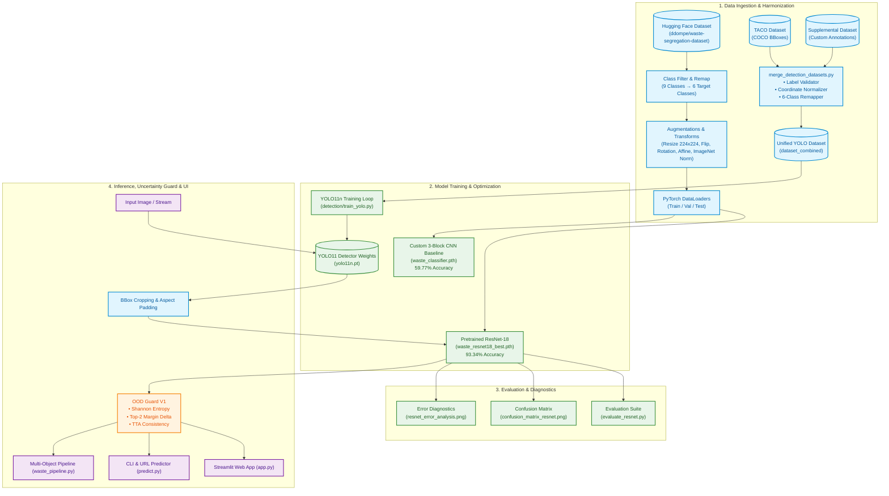
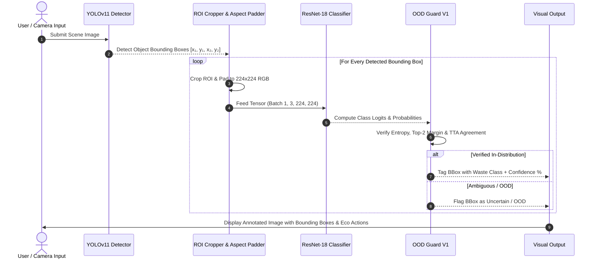

<div align="center">

# ♻️ Smart Waste Classifier
### Deep Learning-Powered Multi-Stage Waste Segregation, Object Detection & Eco-Disposal Guidance System


[](https://www.python.org/)
[](https://pytorch.org/)
[](https://github.com/ultralytics/ultralytics)
[](https://streamlit.io/)
[](https://huggingface.co/datasets/ddompe/waste-segregation-dataset)
[](https://pytorch.org/vision/main/models/resnet.html)
[](#-model-benchmarks--performance)
[](https://developer.nvidia.com/cuda-zone)
[](LICENSE)

<p align="center">
  <strong>An intelligent, end-to-end computer vision platform that localizes and classifies municipal and household waste into 6 recyclable and organic streams with 93.34% accuracy, equipped with OOD Guard V1 uncertainty filtering and real-time eco-guidance.</strong>
</p>

[Key Features](#-key-features) •
[System Architecture](#-system-architecture) •
[Dual-Stage Detection Pipeline](#-dual-stage-cascaded-detection-pipeline) •
[Dataset Strategy](#-dataset-curation--harmonization) •
[Model Benchmarks](#-model-benchmarks--performance) •
[Streamlit App](#-interactive-streamlit-web-app) •
[CLI & URL Inference](#-cli-inference-engine) •
[Quickstart](#-quickstart-guide) •
[Architecture Specs](ARCHITECTURE.md) •
[Project Structure](#-project-structure)

---

</div>

## 📌 Problem Statement & Motivation

Improper waste segregation is one of the leading drivers of municipal landfill overflow, ocean contamination, and recycling stream failure. When recyclable items (such as plastics, metals, or paper) are contaminated with food organics or sorted incorrectly, entire batches of recyclable materials become unprocessable and end up in incinerators or landfills.

**Smart Waste Classifier** solves this challenge by leveraging modern transfer learning, convolutional neural networks, and real-time object detection to:
1. **Automate multi-object detection & classification** across 6 primary waste streams in real time.
2. **Eliminate human sorting error** using high-confidence deep learning predictions.
3. **Filter out-of-distribution & ambiguous noise** via **OOD Guard V1** (Shannon entropy, margin delta, test-time augmentations).
4. **Harmonize diverse waste datasets** (TACO COCO datasets + Supplemental custom datasets) into an industrial unified standard.
5. **Educate end users** with contextual eco-guidelines, bin allocation rules, and preparation tips (e.g., flattening cardboard, rinsing containers, separating organic compost).

---

## 🌟 Key Features

- 🧠 **High-Performance ResNet-18 Backbone**: Fine-tuned on a filtered, curated multi-class dataset achieving **93.34% test accuracy** (659 / 706 correct test predictions).
- 🔬 **Transfer Learning vs. Baseline Comparison**: Includes a custom 3-block 2D-CNN baseline (59.77%) and demonstrates a **+33.57% accuracy improvement** through transfer learning.
- 🎯 **Real-Time YOLOv11 Multi-Object Detection**: Integrated YOLO11n detector for multi-item localization and bounding box segmentation.
- 🔄 **Dual-Stage Cascaded Pipeline (`waste_pipeline.py`)**: Seamlessly connects YOLO object localization with fine-grained ResNet-18 material classification.
- 🛡️ **OOD Guard V1 Uncertainty Engine**: Filters non-waste/ambiguous objects using Shannon entropy, top-2 margin analysis, and Test-Time Augmentation (TTA) consistency.
- 🗂️ **Automated Dataset Fusion Engine (`detection/merge_detection_datasets.py`)**: Validates, remaps, and fuses heterogeneous datasets into a clean 6-class YOLO structure.
- 🌐 **Interactive Streamlit Web Dashboard**: Upload waste images or use a live webcam feed for instant classification, top-3 ranked probabilities, and disposal guidance.
- ⚡ **Dual-Mode CLI Inference Engine (`predict.py`)**: Predict waste categories directly from local image files or direct image URLs from the web.
- 📊 **Robust MLOps & Diagnostics**: Built-in scripts for learning rate scheduling (`ReduceLROnPlateau`), error analysis, confusion matrix plotting, and dataset inspection.
- 🚀 **Hardware Acceleration**: Automatic GPU detection (CUDA) with fallback to CPU execution.

---

## 🏗️ System Architecture

For complete in-depth technical documentation and sequence diagrams, refer to [**`ARCHITECTURE.md`**](ARCHITECTURE.md).



---

## 🎯 Dual-Stage Cascaded Detection Pipeline

When processing complex scenes with multiple objects or cluttered backgrounds, the **Cascaded Dual-Stage Inference Pipeline** (`waste_pipeline.py`) performs localized detection followed by fine-grained classification:



### Visual Pipeline Demonstrations

| YOLO Multi-Object Localization | Multi-Stage Cascade Output |
|:---:|:---:|
|  |  |

---

## 📊 Dataset Curation & Harmonization

The dataset strategy combines single-object classification datasets with multi-object detection datasets, unified under a standardized 6-class taxonomy.

### Target Waste Classes & Disposal Taxonomy

| Icon | Class Name | Target ID | Category | Disposal & Recycling Action |
|:---:|:---|:---:|:---|:---|
| 📦 | **Cardboard** | `0` | Recyclable / Dry Waste | Flatten boxes, keep clean and dry, place in cardboard recycling. |
| 🍎 | **Food Organics** | `1` | Organic / Compost | Place in organic waste bin or home composter; keep away from recyclables. |
| 🍾 | **Glass** | `2` | Recyclable Waste | Rinse containers, remove caps/lids, place in glass collection bin. |
| 🥫 | **Metal** | `3` | Recyclable Waste | Empty and rinse aluminum and tin cans; place in dry recyclables. |
| 📄 | **Paper** | `4` | Recyclable / Dry Waste | Keep dry and free of grease/oil; place in paper recycling stream. |
| 🧴 | **Plastic** | `5` | Recyclable Waste | Rinse plastic bottles and containers; check local polymer acceptance. |

### Dataset Visual Exploration


---

## 📈 Model Benchmarks & Performance

### Quantitative Model Comparison

| Metric | Custom Baseline CNN (`model.py`) | Fine-Tuned ResNet-18 (`model_resnet.py`) | Improvement |
|:---|:---:|:---:|:---:|
| **Architecture** | 3-Block Conv2D + Dense(256) | Deep Residual Network (18 layers) | Deep residual skips |
| **Pretrained Weights** | None (Trained from scratch) | ImageNet-1K (`ResNet18_Weights.DEFAULT`) | Transfer learning |
| **Input Resolution** | $128 \times 128$ | $224 \times 224$ | +75% resolution |
| **Optimization** | Adam ($lr=0.001$) | Adam ($lr=0.0001$) + `ReduceLROnPlateau` | Dynamic LR decay |
| **Test Accuracy** | **59.77%** | **93.34%** | **+33.57% 🚀** |
| **Test Loss** | ~1.1400 | **0.2114** | **-0.9286 loss** |
| **Correct / Total** | 422 / 706 | **659 / 706** | **+237 correct items** |

### Confusion Matrix (ResNet-18)


### Error Diagnostics & Edge Cases

The error analysis module (`error_analysis.py`) identifies the highest-confidence misclassifications (e.g., reflective metal cans resembling clear glass containers or coated glossy cardboard resembling plastic):


---

## 🖥️ Interactive Streamlit Web App

The Streamlit web application (`app.py`) provides an intuitive UI for users and municipal sorting operators:

- 📤 **Instant Image Upload**: Supports `.jpg`, `.jpeg`, and `.png` image formats.
- 🎯 **Prediction with Confidence Gauge**: Live confidence percentage with dynamic status indicators (`High`, `Moderate`, `Low`).
- 💡 **Actionable Eco-Advice**: Step-by-step instructions on proper bin placement and item preparation.
- 📊 **Probability Distribution**: Full confidence breakdown across all 6 classes and Top-3 ranked results with visual progress bars.
- 🛡️ **OOD Guard V1**: Real-time out-of-distribution detection to flag non-waste or ambiguous objects.

```bash
streamlit run app.py
```

---

## 💻 CLI Inference Engine

Run standalone predictions from your terminal without opening a web browser:

### 1. Predict from a Local Image

```bash
python predict.py "path/to/waste_image.jpg"
```

### 2. Predict from a Web Image URL

```bash
python predict.py "https://images.unsplash.com/photo-1530587191325-3db32d826c18?w=500"
```

---

## 🚀 Quickstart Guide

### Prerequisites

- Python 3.10 or higher
- (Optional) NVIDIA GPU with CUDA drivers for accelerated training and inference

### 1. Clone the Repository

```bash
git clone https://github.com/Snigdha-0210/Smart_Waste_Classifier.git
cd Smart_Waste_Classifier
```

### 2. Create and Activate a Virtual Environment

```bash
# Windows (PowerShell)
python -m venv .venv
.\.venv\Scripts\Activate.ps1

# Linux / macOS
python3 -m venv .venv
source .venv/bin/activate
```

### 3. Install Dependencies

```bash
pip install -r requirements.txt
```

### 4. Launch the Streamlit App

```bash
streamlit run app.py
```

Open your browser at `http://localhost:8501`.

---

## 📁 Project Structure

```text
Smart_Waste_Classifier/
│
├── .gitignore                         # Git exclusion rules
├── LICENSE                            # MIT Open-Source License
├── README.md                          # Comprehensive project documentation
├── ARCHITECTURE.md                    # Detailed system architecture specifications & diagrams
├── DATASET_PLAN.md                    # Data curation, filtering & augmentation strategy
├── requirements.txt                   # Production Python dependencies
│
├── app.py                             # Interactive Streamlit Web Application (with OOD Guard V1)
├── model_resnet.py                    # ResNet-18 Transfer Learning Model Definition
├── model.py                           # Baseline Custom 3-Block CNN Model Definition
├── prepare_data.py                    # Dataset loading, filtering, and DataLoader pipeline
├── train_resnet.py                    # ResNet-18 training script with LR scheduler & checkpointing
├── train.py                           # Baseline CNN training script
├── evaluate_resnet.py                 # ResNet-18 quantitative test evaluation
├── evaluate.py                        # Baseline CNN test evaluation
├── predict.py                         # Standalone CLI & URL inference engine with OOD Guard
├── detect_waste.py                    # YOLO real-time multi-object detection script
├── waste_pipeline.py                  # End-to-end cascaded YOLO detection + ResNet-18 pipeline
├── prepare_detection_data.py          # TACO-to-YOLO dataset converter V1
├── prepare_detection_data_v2.py       # TACO-to-YOLO converter V2 with stratified split protection
├── train_yolo.py                      # YOLO custom training pipeline
├── test_yolo.py                       # YOLO detection inference and benchmarking script
├── project_status.py                  # Diagnostic system health & environment check script
├── confusion_matrix_resnet.py         # Confusion matrix and classification report generator
├── confusion_matrix.py                # Baseline CNN confusion matrix generator
├── error_analysis.py                  # High-confidence error analysis & visualization script
├── inspect_dataset.py                 # Dataset split and class distribution inspection
├── visualize_dataset.py               # Single sample visualization script
├── visualize_dataset_multiple.py      # Multi-sample grid visualizer
│
├── detection/                         # Detection Subsystem & Harmonization
│   ├── merge_detection_datasets.py    # Multi-dataset fusion, remapping & validation script
│   ├── train_yolo.py                  # YOLOv11 training script on combined 6-class dataset
│   ├── download_taco_images.py        # Automated TACO dataset image downloader
│   └── data.yaml                      # YOLO dataset configuration
│
├── waste_resnet18_best.pth            # Trained ResNet-18 weights (93.34% Test Accuracy)
├── waste_classifier.pth               # Trained Baseline CNN weights (59.77% Test Accuracy)
├── yolo11n.pt                         # YOLOv11 neural network weights
│
├── dataset_samples.png                # Dataset sample preview image
├── dataset_samples_multiple.png       # Comprehensive multi-class sample grid
├── confusion_matrix_resnet.png        # ResNet-18 confusion matrix plot
├── confusion_matrix.png               # Baseline CNN confusion matrix plot
├── resnet_error_analysis.png          # ResNet-18 error analysis visual grid
├── detected_waste.jpg                 # YOLO object detection output preview
├── waste_pipeline_result.jpg          # Multi-object detection + classification visual result
└── thumbnail.jpg                      # Project banner & social preview thumbnail
```

---

## 🔮 Future Roadmap

- [x] **YOLO Object Detection Prototype**: Added YOLO object detection testing pipeline (`detect_waste.py`, `waste_pipeline.py`).
- [x] **OOD Guard System**: Implemented Out-of-Distribution uncertainty handling in Streamlit.
- [x] **Dataset Harmonization Engine**: Multi-dataset fusion script (`detection/merge_detection_datasets.py`) for combined detection training.
- [ ] **Edge Deployment**: Optimize models with TensorRT / ONNX Runtime for deployment on embedded devices (e.g., Raspberry Pi, NVIDIA Jetson) in smart bin hardware.
- [ ] **Mobile Application**: Build a Flutter / React Native camera companion app for on-the-go waste sorting.
- [ ] **Expanded Class Taxonomy**: Include E-waste (electronic waste), hazardous chemicals, and battery categories with dedicated disposal workflows.

---

## 🤝 Contributing

Contributions are welcome! If you'd like to improve the model, add features, or refine the web app:

1. Fork the project repository.
2. Create your feature branch (`git checkout -b feature/AmazingFeature`).
3. Commit your changes (`git commit -m 'Add some AmazingFeature'`).
4. Push to the branch (`git push origin feature/AmazingFeature`).
5. Open a Pull Request.

---

## 📄 License

Distributed under the **MIT License**. See [`LICENSE`](LICENSE) for more details.

---

## 👩‍💻 Author & Acknowledgements

Developed with ❤️ by **[Snigdha](https://github.com/Snigdha-0210)**.

- Dataset provided by [`ddompe/waste-segregation-dataset`](https://huggingface.co/datasets/ddompe/waste-segregation-dataset) on Hugging Face and TACO dataset.
- Built with [PyTorch](https://pytorch.org/), [Ultralytics YOLO](https://github.com/ultralytics/ultralytics), and [Streamlit](https://streamlit.io/).
