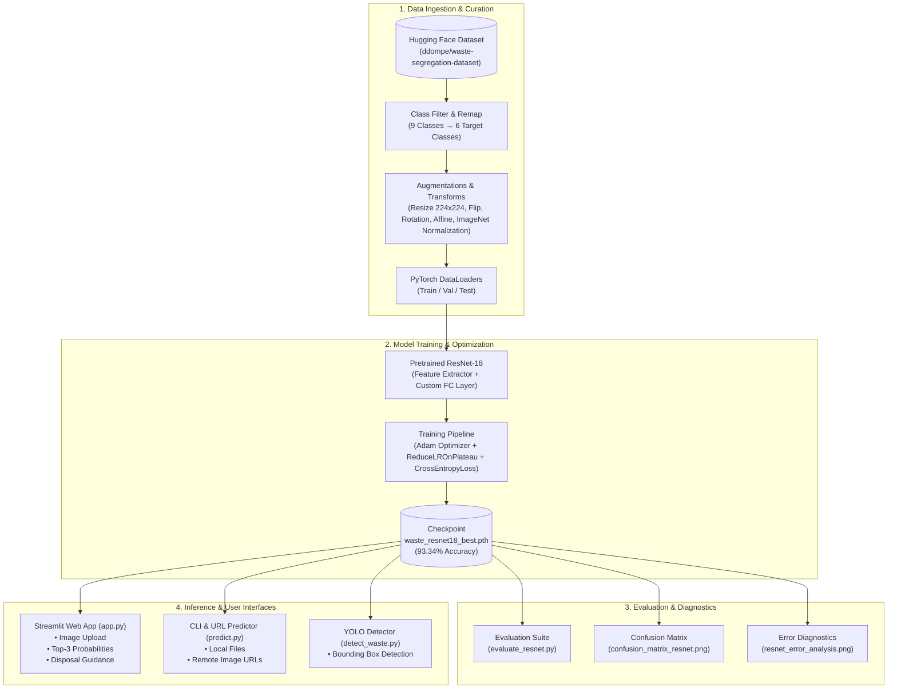

<div align="center">

# ♻️ Smart Waste Classifier
### Deep Learning-Powered Waste Segregation & Eco-Disposal Guidance System

[](https://www.python.org/)
[](https://pytorch.org/)
[](https://streamlit.io/)
[](https://huggingface.co/datasets/ddompe/waste-segregation-dataset)
[](https://pytorch.org/vision/main/models/resnet.html)
[](#-model-benchmarks--performance)
[](https://developer.nvidia.com/cuda-zone)
[](LICENSE)

<p align="center">
  <strong>An intelligent computer vision application that classifies municipal and household waste into 6 recyclable and organic streams with 93.34% accuracy, providing real-time recycling advice.</strong>
</p>

[Key Features](#-key-features) •
[System Architecture](#-system-architecture) •
[Dataset](#-dataset-overview) •
[Model Benchmarks](#-model-benchmarks--performance) •
[Streamlit App](#-interactive-streamlit-web-app) •
[CLI Inference](#-cli-inference-engine) •
[Quickstart](#-quickstart-guide) •
[Project Structure](#-project-structure)

---

</div>

## 📌 Problem Statement & Motivation

Improper waste segregation is one of the leading drivers of municipal landfill overflow, ocean contamination, and recycling stream failure. When recyclable items (such as plastics, metals, or paper) are contaminated with food organics or sorted incorrectly, entire batches of recyclable materials become unprocessable and end up in incinerators or landfills.

**Smart Waste Classifier** solves this challenge by leveraging modern transfer learning and convolutional neural networks to:
1. **Automate classification** across 6 primary waste streams in real time.
2. **Eliminate human sorting error** using high-confidence deep learning predictions.
3. **Educate end users** with contextual eco-guidelines, bin allocation rules, and preparation tips (e.g., flattening cardboard, rinsing containers, separating organic compost).

---

## 🌟 Key Features

- 🧠 **High-Performance ResNet-18 Backbone**: Fine-tuned on a filtered, curated multi-class dataset achieving **93.34% test accuracy** (659 / 706 correct test predictions).
- 🔬 **Transfer Learning vs. Baseline Comparison**: Includes a custom 3-block 2D-CNN baseline (59.77%) and demonstrates a **+33.57% accuracy improvement** through transfer learning.
- 🌐 **Interactive Streamlit Web Dashboard**: Upload any waste image to receive instant classification, confidence scores, probability distributions, and tailored disposal action items.
- ⚡ **Dual-Mode CLI Inference Engine (`predict.py`)**: Predict waste categories directly from local image files or direct image URLs from the web.
- 🎯 **Real-time Object Detection Prototype (`detect_waste.py`)**: Integrated YOLOv11 detector for localized object bounding boxes.
- 📊 **Robust MLOps & Diagnostics**: Built-in scripts for learning rate scheduling (`ReduceLROnPlateau`), error analysis, confusion matrix plotting, and dataset inspection.
- 🚀 **Hardware Acceleration**: Automatic GPU detection (CUDA) with fallback to CPU execution.

---

## 🏗️ System Architecture



---

## 📊 Dataset Overview

The model is trained on a curated subset of the [`ddompe/waste-segregation-dataset`](https://huggingface.co/datasets/ddompe/waste-segregation-dataset) from Hugging Face Hub. Ambiguous and noisy classes (*Miscellaneous Trash*, *Textile Trash*, and *Vegetation*) were excluded to establish well-defined, distinct waste boundaries.

### Target Waste Classes & Disposal Taxonomy

| Icon | Class Name | Target ID | Category | Disposal & Recycling Action |
|:---:|:---|:---:|:---|:---|
| 📦 | **Cardboard** | `0` | Recyclable / Dry Waste | Flatten boxes, keep clean and dry, place in cardboard recycling. |
| 🍎 | **Food Organics** | `1` | Organic / Compost | Place in organic waste bin or home composter; keep away from recyclables. |
| 🍾 | **Glass** | `2` | Recyclable Waste | Rinse containers, remove caps/lids, place in glass collection bin. |
| 🥫 | **Metal** | `3` | Recyclable Waste | Empty and rinse aluminum and tin cans; place in dry recyclables. |
| 📄 | **Paper** | `4` | Recyclable / Dry Waste | Keep dry and free of grease/oil; place in paper recycling stream. |
| 🧴 | **Plastic** | `5` | Recyclable Waste | Rinse plastic bottles and containers; check local polymer acceptance. |

### Dataset Samples Preview


### Data Preprocessing & Augmentation Strategy

- **Input Dimensions**: $224 \times 224$ pixels (RGB, 3 channels)
- **Normalization**: ImageNet standards ($\mu = [0.485, 0.456, 0.406]$, $\sigma = [0.229, 0.224, 0.225]$)
- **Augmentation Pipeline (Train)**:
  - `RandomHorizontalFlip(p=0.5)`
  - `RandomRotation(degrees=10)`
  - `RandomAffine(degrees=0, translate=(0.05, 0.05), scale=(0.90, 1.10))`
- **Validation/Test Pipeline**: Deterministic resize to $224 \times 224$ + standard normalization (no stochastic augmentation).

---

## 📈 Model Benchmarks & Performance

### Model Comparison

| Metric | Custom Baseline CNN (`model.py`) | Fine-Tuned ResNet-18 (`model_resnet.py`) | Improvement |
|:---|:---:|:---:|:---:|
| **Architecture** | 3-Block Conv2D + Dense(256) | Deep Residual Network (18 layers) | Deep residual skips |
| **Pretrained Weights** | None (Trained from scratch) | ImageNet-1K (`ResNet18_Weights.DEFAULT`) | Transfer learning |
| **Input Resolution** | $128 \times 128$ | $224 \times 224$ | +75% resolution |
| **Optimization** | Adam ($lr=0.001$) | Adam ($lr=0.0001$) + `ReduceLROnPlateau` | Fine-tuned learning rate |
| **Test Accuracy** | **59.77%** | **93.34%** | **+33.57% 🚀** |
| **Test Loss** | ~1.1400 | **0.2114** | **-0.9286 loss** |
| **Correct / Total** | 422 / 706 | **659 / 706** | **+237 correct items** |

### Confusion Matrix (ResNet-18)

The confusion matrix demonstrates strong diagonal dominance across all 6 classes, with minimal inter-class confusion:


### Error Diagnostics & Edge Cases

The error analysis module (`error_analysis.py`) identifies the highest-confidence misclassifications (e.g., highly reflective metal cans resembling clear glass containers or coated glossy cardboard resembling plastic):


---

## 🖥️ Interactive Streamlit Web App

The Streamlit web application (`app.py`) provides an intuitive UI for users and municipal sorting operators:

- 📤 **Instant Image Upload**: Supports `.jpg`, `.jpeg`, and `.png` image formats.
- 🎯 **Prediction with Confidence Gauge**: Live confidence percentage with dynamic status indicators (`High`, `Moderate`, `Low`).
- 💡 **Actionable Eco-Advice**: Step-by-step instructions on proper bin placement and item preparation.
- 📊 **Probability Distribution**: Full confidence breakdown across all 6 classes and Top-3 ranked results with visual progress bars.

```bash
streamlit run app.py
```

---

## 💻 CLI Inference Engine

Run standalone predictions from your terminal without opening a web browser:

### 1. Predict from a Local Image

```bash
python predict.py "path/to/waste_image.jpg"
```

### 2. Predict from a Web Image URL

```bash
python predict.py "https://images.unsplash.com/photo-1530587191325-3db32d826c18?w=500"
```

### Sample CLI Output

```text
=================================================================
SMART WASTE CLASSIFIER
=================================================================
Device: cuda
GPU: NVIDIA GeForce RTX 3060

Loading trained model...
Trained model loaded successfully!

Downloading image from web...
Web image downloaded successfully.

=================================================================
PREDICTION RESULT
=================================================================
Predicted waste : Plastic
Confidence      : 98.42%

=================================================================
CLASS PROBABILITIES
=================================================================
Plastic             :  98.42%
Glass               :   0.89%
Metal               :   0.45%
Paper               :   0.14%
Cardboard           :   0.07%
Food Organics       :   0.03%

=================================================================
CONFIDENCE ANALYSIS
=================================================================
Confidence level : VERY HIGH
=================================================================
```

---

## 🚀 Quickstart Guide

### Prerequisites

- Python 3.10 or higher
- (Optional) NVIDIA GPU with CUDA drivers for accelerated training and inference

### 1. Clone the Repository

```bash
git clone https://github.com/Snigdha-0210/Smart_Waste_Classifier.git
cd Smart_Waste_Classifier
```

### 2. Create and Activate a Virtual Environment

```bash
# Windows (PowerShell)
python -m venv .venv
.\.venv\Scripts\Activate.ps1

# Linux / macOS
python3 -m venv .venv
source .venv/bin/activate
```

### 3. Install Dependencies

```bash
pip install -r requirements.txt
```

*(Note: If you have a CUDA-compatible GPU, install the CUDA PyTorch build according to the [official PyTorch guide](https://pytorch.org/get-started/locally/).)*

### 4. Launch the Streamlit App

```bash
streamlit run app.py
```

Open your browser at `http://localhost:8501`.

### 5. Train the Model from Scratch (Optional)

```bash
# Prepare data and train ResNet-18
python train_resnet.py

# Evaluate on the test split
python evaluate_resnet.py

# Generate confusion matrix and error analysis plots
python confusion_matrix_resnet.py
python error_analysis.py
```

---

## 📁 Project Structure

```text
Smart_Waste_Classifier/
│
├── .gitignore                         # Git exclusion rules
├── LICENSE                            # MIT Open-Source License
├── README.md                          # Comprehensive project documentation
├── requirements.txt                   # Production Python dependencies
├── DATASET_PLAN.md                    # Data curation, filtering & augmentation strategy
│
├── app.py                             # Interactive Streamlit Web Application
├── model_resnet.py                    # ResNet-18 Transfer Learning Model Definition
├── model.py                           # Baseline Custom 3-Block CNN Model Definition
├── prepare_data.py                    # Dataset loading, filtering, and DataLoader pipeline
├── train_resnet.py                    # ResNet-18 training script with LR scheduler & checkpointing
├── train.py                           # Baseline CNN training script
├── evaluate_resnet.py                 # ResNet-18 quantitative test evaluation
├── evaluate.py                        # Baseline CNN test evaluation
├── predict.py                         # Standalone CLI & URL inference engine
├── detect_waste.py                    # YOLOv11 real-time multi-object detection script
├── confusion_matrix_resnet.py         # Confusion matrix and classification report generator
├── error_analysis.py                  # High-confidence error analysis & visualization script
├── inspect_dataset.py                 # Dataset split and class distribution inspection
├── visualize_dataset.py               # Single sample visualization script
├── visualize_dataset_multiple.py      # Multi-sample grid visualizer
│
├── waste_resnet18_best.pth            # Trained ResNet-18 weights (93.34% Test Accuracy)
├── waste_classifier.pth               # Trained Baseline CNN weights (59.77% Test Accuracy)
├── yolo11n.pt                         # YOLOv11 neural network weights
│
├── dataset_samples.png                # Dataset sample preview image
├── dataset_samples_multiple.png       # Comprehensive multi-class sample grid
├── confusion_matrix_resnet.png        # ResNet-18 confusion matrix plot
├── confusion_matrix.png               # Baseline CNN confusion matrix plot
├── resnet_error_analysis.png          # ResNet-18 error analysis visual grid
└── detected_waste.jpg                 # YOLO object detection output preview
```

---

## 🔮 Future Roadmap

- [x] **YOLO Object Detection Prototype**: Added YOLOv11 object detection testing pipeline (`detect_waste.py`).
- [ ] **Edge Deployment**: Optimize models with TensorRT / ONNX Runtime for deployment on embedded devices (e.g., Raspberry Pi, NVIDIA Jetson) in smart bin hardware.
- [ ] **Mobile Application**: Build a Flutter / React Native camera companion app for on-the-go waste sorting.
- [ ] **Expanded Class Taxonomy**: Include E-waste (electronic waste), hazardous chemicals, and battery categories with dedicated disposal workflows.

---

## 🤝 Contributing

Contributions are welcome! If you'd like to improve the model, add features, or refine the web app:

1. Fork the project repository.
2. Create your feature branch (`git checkout -b feature/AmazingFeature`).
3. Commit your changes (`git commit -m 'Add some AmazingFeature'`).
4. Push to the branch (`git push origin feature/AmazingFeature`).
5. Open a Pull Request.

---

## 📄 License

Distributed under the **MIT License**. See [`LICENSE`](LICENSE) for more details.

---

## 👩‍💻 Author & Acknowledgements

Developed with ❤️ by **[Snigdha](https://github.com/Snigdha-0210)**.

- Dataset provided by [`ddompe/waste-segregation-dataset`](https://huggingface.co/datasets/ddompe/waste-segregation-dataset) on Hugging Face.
- Built with [PyTorch](https://pytorch.org/) and [Streamlit](https://streamlit.io/).
