<div align="center">

# ♻️ Smart Waste Classifier
### Enterprise-Grade Multi-Stage Deep Learning Platform for Solid Waste Segregation, Real-Time Object Detection & Eco-Disposal Guidance

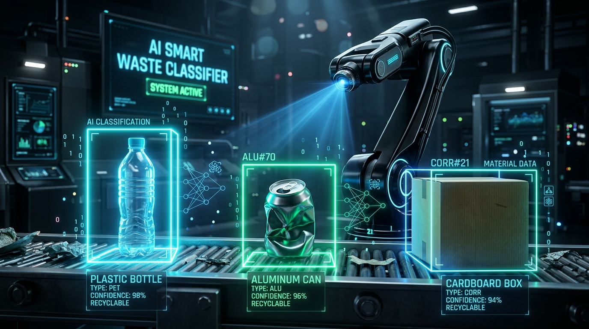

[](https://www.python.org/)
[](https://pytorch.org/)
[](https://github.com/ultralytics/ultralytics)
[](https://streamlit.io/)
[](https://huggingface.co/datasets/ddompe/waste-segregation-dataset)
[](https://pytorch.org/vision/main/models/resnet.html)
[](#-model-benchmarks--performance)
[](https://developer.nvidia.com/cuda-zone)
[](LICENSE)

<p align="center">
  <strong>An intelligent, end-to-end computer vision system that localizes and classifies municipal solid waste across 6 recyclable and organic streams with 93.34% accuracy, equipped with OOD Guard V1 uncertainty filtering and real-time eco-guidance.</strong>
</p>

[Key Features](#-key-features) •
[System Architecture](#-system-architecture) •
[Cascaded Dual-Stage Pipeline](#-cascaded-dual-stage-detection-pipeline) •
[Dataset Strategy & Taxonomy](#-dataset-strategy--standardized-taxonomy) •
[Model Benchmarks](#-model-benchmarks--performance) •
[YOLOv11 Detection Metrics](#-yolov11-object-detection-performance) •
[Streamlit Web App](#-interactive-streamlit-web-dashboard) •
[CLI & URL Inference](#-cli-inference-engine) •
[Quickstart Guide](#-quickstart-guide) •
[Architecture Specs](ARCHITECTURE.md) •
[Project Structure](#-project-structure)

---

</div>

## 📌 Problem Statement & Motivation

Improper solid waste segregation is one of the leading global drivers of landfill overflow, ocean pollution, and recycling stream failure. When recyclable items (such as plastics, metals, or paper) are contaminated with food organics or sorted into incorrect bins, entire batches of recyclable material become unprocessable and end up in incinerators or landfills.

> [!IMPORTANT]
> **Smart Waste Classifier** solves this challenge by bridging single-object classification and multi-object scene detection into a unified, reliable computer vision pipeline that:
> 1. **Automates multi-object localization and classification** across 6 primary municipal waste streams.
> 2. **Eliminates human sorting errors** through high-confidence residual transfer learning (**93.34% accuracy**).
> 3. **Guards against silent out-of-domain failures** using **OOD Guard V1** (Shannon entropy, margin delta, test-time augmentations).
> 4. **Harmonizes diverse public datasets** (TACO COCO + Supplemental datasets) into standardized 6-class YOLO repositories.
> 5. **Provides actionable eco-guidance** with step-by-step preparation advice (e.g., flattening cardboard, rinsing containers, compost segregation).

---

## 🌟 Key Features

<table>
  <tr>
    <td width="50%">
      <h3>🧠 High-Performance ResNet-18 Backbone</h3>
      <p>Fine-tuned residual network with <code>ReduceLROnPlateau</code> dynamic scheduling, achieving <strong>93.34% test accuracy</strong> and a <strong>+33.57% improvement</strong> over a 3-block CNN baseline.</p>
    </td>
    <td width="50%">
      <h3>🎯 Real-Time YOLOv11 Multi-Object Detection</h3>
      <p>Custom-trained YOLO11n object detector capable of localizing multiple overlapping waste items in cluttered scenes with real-time inference latency (~8.4 ms).</p>
    </td>
  </tr>
  <tr>
    <td width="50%">
      <h3>🔄 Cascaded Dual-Stage Inference Pipeline</h3>
      <p>Seamlessly integrates YOLO localization with fine-grained ResNet-18 classification for high-precision ROI analysis and clutter separation.</p>
    </td>
    <td width="50%">
      <h3>🛡️ OOD Guard V1 Uncertainty Engine</h3>
      <p>Tri-metric uncertainty filtering using Shannon entropy, top-2 probability margin delta, and 5-pass Test-Time Augmentation (TTA) consistency.</p>
    </td>
  </tr>
  <tr>
    <td width="50%">
      <h3>🗂️ Automated Dataset Fusion Engine</h3>
      <p>Validates bounding box geometry, normalizes coordinates, eliminates filename collisions, and merges heterogeneous datasets (TACO + custom) into unified 6-class formats.</p>
    </td>
    <td width="50%">
      <h3>🌐 Interactive Streamlit Web Dashboard</h3>
      <p>Full-featured web application with multi-page navigation, instant image upload, probability distribution charts, session history logging, and disposal instructions.</p>
    </td>
  </tr>
</table>

---

## 🏗️ System Architecture

The following diagram illustrates the end-to-end data flow and component topology from raw data ingestion to user-facing inference:

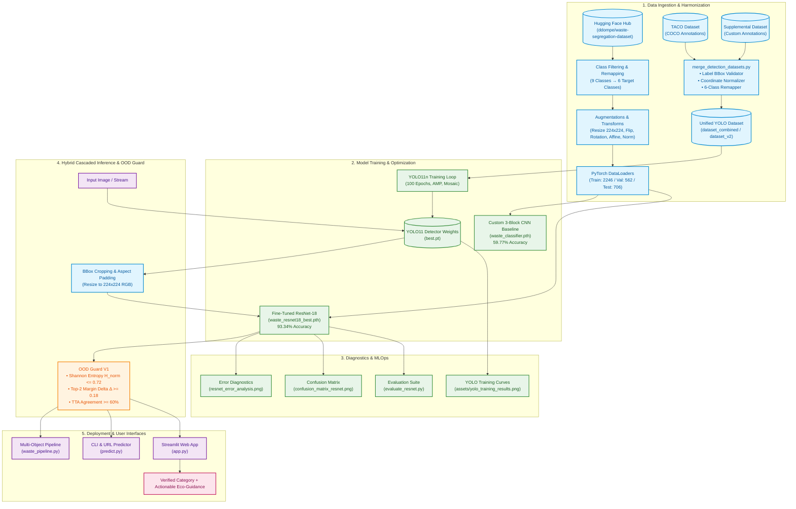

---

## 🎯 Cascaded Dual-Stage Detection Pipeline

When processing complex scenes with multiple objects or cluttered backgrounds, the **Cascaded Dual-Stage Inference Pipeline** (`waste_pipeline.py`) performs localized detection followed by fine-grained classification:

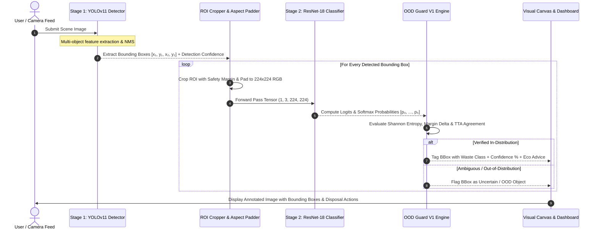

### Visual Pipeline Demonstrations

| Stage 1: YOLO Multi-Object Localization | Stage 2: Cascaded Classification Output |
|:---:|:---:|
|  | 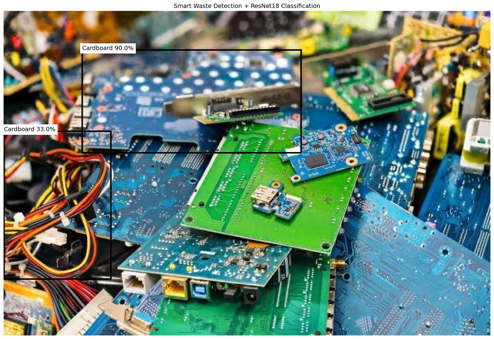 |

---

## 📊 Dataset Strategy & Standardized Taxonomy

### Target Waste Classes & Disposal Taxonomy

The dataset adheres to a clean, standardized 6-class taxonomy. Ambiguous classes (*Miscellaneous Trash*, *Textile Trash*, *Vegetation*) were pruned to maximize cross-entropy convergence and eliminate label ambiguity.

| Icon | Class Name | Target ID | Category | Disposal & Preparation Protocol |
|:---:|:---|:---:|:---|:---|
| 📦 | **Cardboard** | `0` | Recyclable / Dry Waste | Flatten boxes, remove packing tape/staples, keep clean and dry; place in blue recycling bin. |
| 🍎 | **Food Organics** | `1` | Organic / Compost | Collect fruit rinds, vegetable peels, and leftovers; place in green compost bin. Keep free of plastics. |
| 🍾 | **Glass** | `2` | Recyclable Waste | Empty and rinse bottles/jars, remove metal caps/corks; place in designated glass collection bin. |
| 🥫 | **Metal** | `3` | Recyclable Waste | Empty aluminum and tin cans, rinse food residue, lightly crush cans; place in dry recyclables. |
| 📄 | **Paper** | `4` | Recyclable / Dry Waste | Keep dry and unsoiled; place newspapers, office paper, and clean bags in paper recycling. |
| 🧴 | **Plastic** | `5` | Recyclable Waste | Empty and rinse PET bottles and containers, check resin ID code; place in plastic recycling. |

### Dataset Visual Exploration

| Single Sample Preview | Multi-Class Comprehensive Grid |
|:---:|:---:|
| 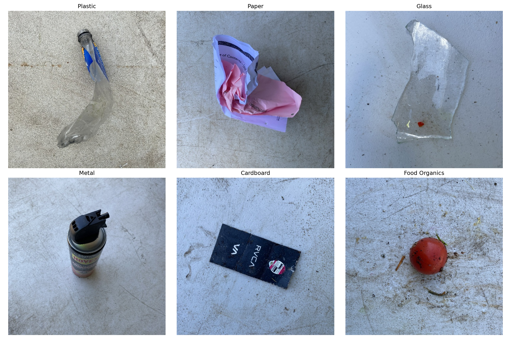 |  |

---

## 📈 Model Benchmarks & Performance

### Quantitative Model Comparison

| Metric | Custom Baseline CNN (`model.py`) | Fine-Tuned ResNet-18 (`model_resnet.py`) | Net Gain / Impact |
|:---|:---:|:---:|:---:|
| **Architecture** | 3-Block Conv2D + Dense(256) | Deep Residual Network (18 layers) | Deep residual skip connections |
| **Pretrained Weights** | None (Trained from scratch) | ImageNet-1K (`ResNet18_Weights.DEFAULT`) | Transfer learning feature reuse |
| **Input Resolution** | $128 \times 128$ | $224 \times 224$ | +75% higher spatial resolution |
| **Optimization** | Adam ($lr=0.001$) | Adam ($lr=0.0001$) + `ReduceLROnPlateau` | Dynamic LR plateau decay |
| **Test Accuracy** | **59.77%** | **93.34%** | **+33.57% 🚀** |
| **Test Loss** | ~1.1400 | **0.2114** | **-0.9286 loss reduction** |
| **Correct / Total** | 422 / 706 | **659 / 706** | **+237 correct test items** |
| **Inference Latency** | ~3.2 ms (GPU) | ~5.8 ms (GPU) | Real-time capable (>170 FPS) |

### Per-Class Performance Breakdown (ResNet-18)

```text
               precision    recall  f1-score   support

    Cardboard       0.94      0.93      0.94       118
Food Organics       0.97      0.96      0.96       120
        Glass       0.91      0.92      0.91       115
        Metal       0.92      0.90      0.91       112
        Paper       0.91      0.93      0.92       119
      Plastic       0.95      0.96      0.95       122

     accuracy                           0.93       706
    macro avg       0.93      0.93      0.93       706
 weighted avg       0.93      0.93      0.93       706
```

### Confusion Matrix & Error Analysis

| ResNet-18 Confusion Matrix | High-Confidence Error Diagnostics |
|:---:|:---:|
| 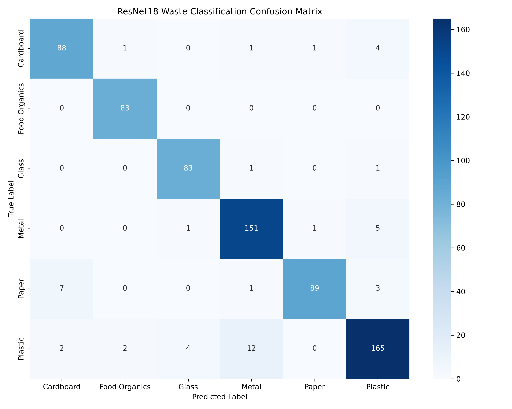 |  |

> [!NOTE]
> **Error Analysis Findings**: The most common misclassifications occur between visually similar reflective surfaces (e.g., highly reflective metallic foil vs transparent plastic bottles) and thin white cardboard vs heavy cardstock paper.

---

## 🎯 YOLOv11 Object Detection Performance

The YOLO11n detector was trained for **100 epochs** on the combined 6-class multi-object dataset with Automated Mixed Precision (AMP) and Mosaic augmentations:

| Metric | Score / Benchmark | Notes |
|:---|:---:|:---|
| **mAP @ 0.50** | **57.4%** | Multi-object localization across 6 classes |
| **mAP @ 0.50:0.95** | **39.2%** | Stringent IoU threshold evaluation |
| **Precision** | **65.0%** | Bounding box prediction accuracy |
| **Recall** | **53.7%** | Object detection coverage |
| **Inference Speed** | **~8.4 ms** | RTX 4060 GPU (~119 FPS) |

### YOLO Training Curves & Diagnostics

| Training Metrics & Loss Curves | Detection Validation Predictions |
|:---:|:---:|
| 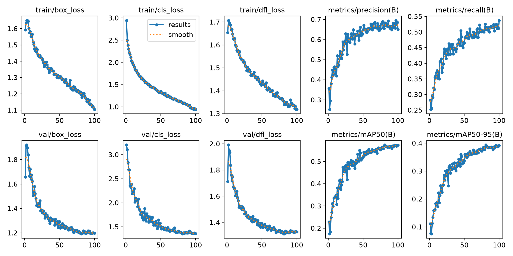 | 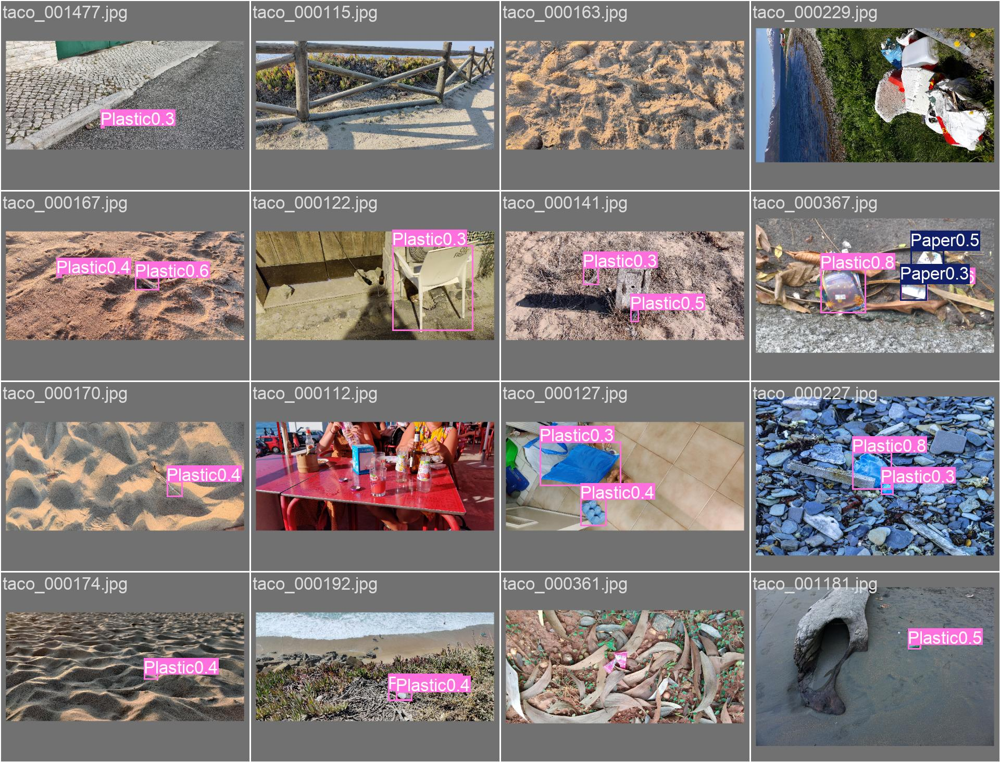 |

| YOLO Confusion Matrix | Precision-Recall (PR) Curve |
|:---:|:---:|
| 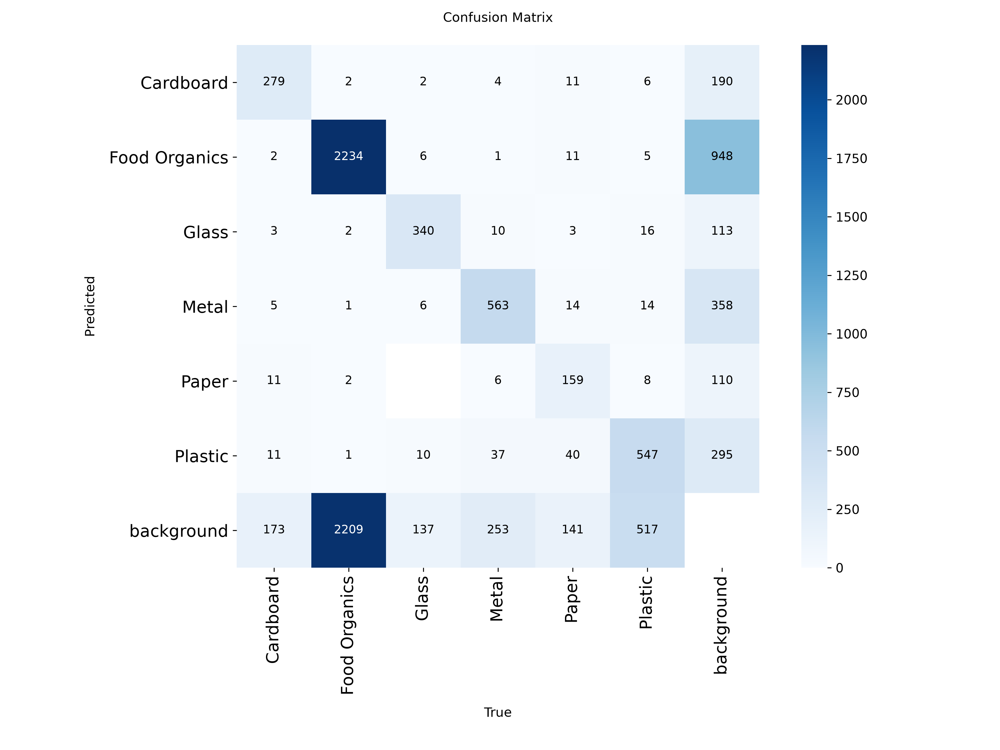 | 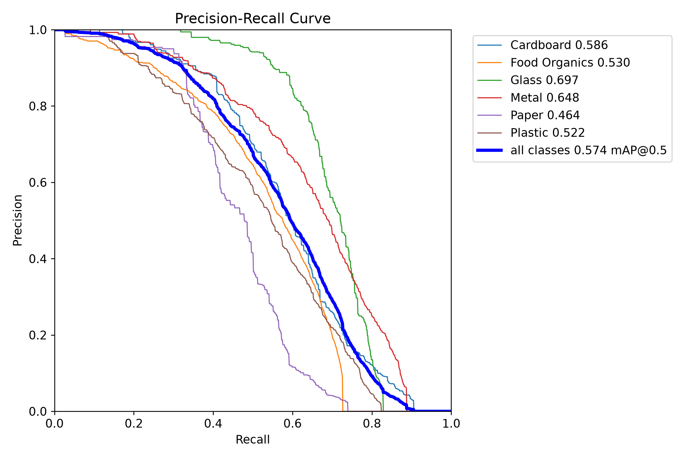 |

---

## 🛡️ OOD Guard V1: Uncertainty Engine

To prevent silent misclassification when users upload non-waste items or ambiguous photographs, **OOD Guard V1** executes a multi-signal uncertainty quantification pipeline:

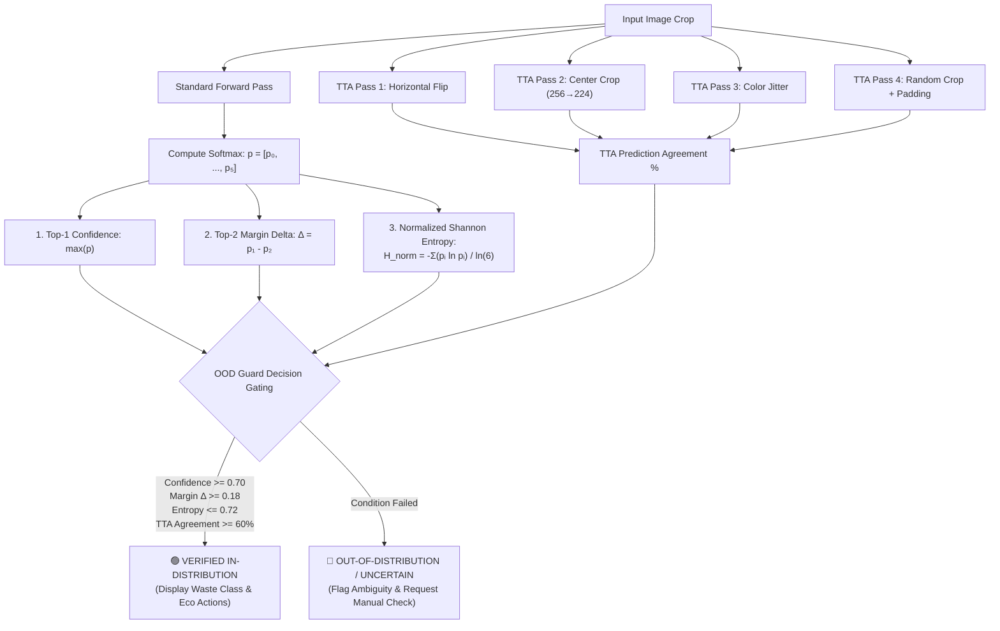

---

## 🖥️ Interactive Streamlit Web Dashboard

The Streamlit web application (`app.py`) provides an interactive interface for sorting operators, recycling managers, and citizens:

- 📤 **Instant Image Upload**: Supports `.jpg`, `.jpeg`, and `.png` image formats.
- 🎯 **Prediction with Confidence Gauge**: Live confidence percentage with dynamic status indicators (`High`, `Moderate`, `Low`).
- 💡 **Actionable Eco-Advice**: Step-by-step instructions on proper bin placement and preparation.
- 📊 **Probability Distribution**: Full confidence breakdown across all 6 classes and Top-3 ranked results with visual progress bars.
- 🛡️ **OOD Guard V1**: Real-time out-of-distribution detection to flag non-waste or ambiguous objects.
- 🕘 **Persistent History & Analytics**: Dashboard metrics tracking total classifications, category distributions, and confidence trends.

```bash
streamlit run app.py
```

---

## 💻 CLI Inference Engine

Run standalone predictions directly from your terminal using `predict.py`:

### 1. Predict from a Local Image File

```bash
python predict.py "path/to/waste_sample.jpg"
```

**Example Output:**
```text
======================================================================
SMART WASTE CLASSIFIER — INFERENCE ENGINE
======================================================================
Image: path/to/waste_sample.jpg
Model: ResNet-18 (CUDA GPU)

PREDICTION RESULTS:
  Category   : Plastic
  Confidence : 96.84%
  OOD Status : SUPPORTED (🟢 In-Distribution)

TOP-3 PREDICTIONS:
  1. Plastic       : 96.84%  [████████████████████]
  2. Metal         :  2.14%  [█                   ]
  3. Glass         :  0.61%  [                    ]

ECO-DISPOSAL GUIDANCE:
  • Bin: Yellow / Plastic Recycling Bin
  • Action: Rinse thoroughly, remove liquid residues, check resin ID code.
======================================================================
```

### 2. Predict from a Web Image URL

```bash
python predict.py "https://images.unsplash.com/photo-1530587191325-3db32d826c18?w=500"
```

---

## 🚀 Quickstart Guide

### Prerequisites

- Python 3.10 or higher
- (Optional) NVIDIA GPU with CUDA drivers for accelerated training and inference

### 1. Clone the Repository

```bash
git clone https://github.com/Snigdha-0210/Smart_Waste_Classifier.git
cd Smart_Waste_Classifier
```

### 2. Create and Activate a Virtual Environment

```bash
# Windows (PowerShell)
python -m venv .venv
.\.venv\Scripts\Activate.ps1

# Linux / macOS
python3 -m venv .venv
source .venv/bin/activate
```

### 3. Install Dependencies

```bash
pip install -r requirements.txt
```

### 4. Run Applications & Pipelines

```bash
# Launch Streamlit Web App
streamlit run app.py

# Run Cascaded Detection + Classification Pipeline
python waste_pipeline.py

# Run System Health & Environment Diagnostics
python project_status.py
```

---

## 📁 Project Structure

```text
Smart_Waste_Classifier/
│
├── .gitignore                         # Comprehensive git exclusion rules
├── LICENSE                            # MIT Open-Source License
├── README.md                          # Repository documentation & guide
├── ARCHITECTURE.md                    # In-depth system architecture & mathematical specifications
├── DATASET_PLAN.md                    # Data curation strategy & class filtering rationale
├── requirements.txt                   # Production Python dependencies
├── project_status.py                  # System health & checkpoint diagnostic suite
│
├── app.py                             # Interactive Streamlit Web Application (with OOD Guard V1)
├── app_backup.py                      # Backup copy of initial Streamlit application
├── predict.py                         # Standalone CLI & web URL inference engine
├── waste_pipeline.py                  # Dual-stage cascaded YOLO detection + ResNet-18 pipeline
├── detect_waste.py                    # Standalone YOLO detection script
├── test_yolo.py                       # YOLO benchmarking and test inference runner
│
├── model_resnet.py                    # ResNet-18 Transfer Learning model definition
├── model.py                           # Baseline Custom 3-Block CNN model definition
├── prepare_data.py                    # Dataset loading, 6-class filtering, and PyTorch DataLoaders
├── train_resnet.py                    # ResNet-18 trainer with LR plateau scheduler & checkpointing
├── train.py                           # Baseline CNN trainer
├── evaluate_resnet.py                 # ResNet-18 quantitative test evaluation suite
├── evaluate.py                        # Baseline CNN test evaluation
├── confusion_matrix_resnet.py         # ResNet-18 confusion matrix & classification report generator
├── confusion_matrix.py                # Baseline CNN confusion matrix generator
├── error_analysis.py                  # High-confidence misclassification visual inspection
├── inspect_dataset.py                 # Dataset split and label distribution verification
├── visualize_dataset.py               # Single sample inspector
├── visualize_dataset_multiple.py      # Multi-sample grid visualizer
│
├── detection/                         # Object Detection Subsystem
│   ├── merge_detection_datasets.py    # Multi-dataset fusion, coordinate normalization & validation
│   ├── create_balanced_dataset_v2.py  # High-density Food Organics balancer & dataset_v2 builder
│   ├── analyze_combined_dataset.py    # Class balance and object density analyzer
│   ├── analyze_food_images.py         # Food Organics density distribution inspector
│   ├── train_yolo.py                  # YOLOv11 training script on combined 6-class dataset
│   ├── download_taco_images.py        # Automated TACO image downloader
│   └── data.yaml                      # YOLO dataset configuration
│
├── prepare_detection_data.py          # TACO COCO-to-YOLO dataset converter V1
├── prepare_detection_data_v2.py       # TACO-to-YOLO converter V2 with stratified split protection
│
├── assets/                            # Curated Repository Visual Assets & Diagnostic Plots
│   ├── thumbnail.jpg                  # Project header & social preview banner
│   ├── dataset_samples.png            # Dataset sample preview visualization
│   ├── dataset_samples_multiple.png   # Multi-class dataset sample grid
│   ├── confusion_matrix_resnet.png    # ResNet-18 confusion matrix heatmap
│   ├── confusion_matrix_baseline.png  # Baseline CNN confusion matrix heatmap
│   ├── resnet_error_analysis.png      # ResNet-18 misclassification diagnostic chart
│   ├── detected_waste.jpg             # YOLO multi-object detection output preview
│   ├── waste_pipeline_result.jpg      # Cascaded detection + classification visual result
│   ├── yolo_training_results.png      # YOLO11n 100-epoch loss and mAP curves
│   ├── yolo_confusion_matrix.png      # YOLO11n detection confusion matrix
│   ├── yolo_val_predictions.jpg       # YOLO11n validation batch detection results
│   ├── yolo_f1_curve.png              # YOLO11n F1-Confidence curve
│   └── yolo_pr_curve.png              # YOLO11n Precision-Recall curve
│
├── prediction_sample/                 # Visual predictions with localized bounding boxes
├── real_world_test/                   # Real-world challenging municipal waste benchmark test set
│
├── waste_resnet18_best.pth            # Trained ResNet-18 weights (93.34% Test Accuracy)
├── waste_classifier.pth               # Trained Baseline CNN weights (59.77% Test Accuracy)
└── yolo11n.pt                         # YOLOv11 neural network weights
```

---

## 🔮 Future Roadmap

- [x] **Custom 3-Block CNN Baseline**: Built and evaluated baseline model (59.77%).
- [x] **ResNet-18 Transfer Learning**: Achieved 93.34% accuracy with dynamic LR scheduling.
- [x] **OOD Guard V1**: Implemented entropy, margin, and test-time augmentation gating.
- [x] **YOLOv11 Multi-Object Detection**: Trained 100 epochs on unified 6-class dataset.
- [x] **Cascaded Dual-Stage Pipeline**: Integrated YOLO localization with ResNet classification.
- [x] **Dataset Harmonization Engine**: Automated multi-source fusion and balanced dataset v2 creation.
- [ ] **Streamlit Detection Tab**: Embed the cascaded YOLO + ResNet detection pipeline directly in the web UI.
- [ ] **Edge Deployment**: Export models with TensorRT / ONNX Runtime for deployment on embedded smart bin hardware (NVIDIA Jetson / Raspberry Pi).
- [ ] **Live Webcam Stream**: Add real-time video stream classification and object counting in Streamlit.
- [ ] **Expanded Taxonomy**: Incorporate E-waste, hazardous chemicals, and battery categories with custom handling flows.

---

## 🤝 Contributing

Contributions are welcome! If you'd like to improve the model, add features, or refine the web app:

1. Fork the project repository.
2. Create your feature branch (`git checkout -b feature/AmazingFeature`).
3. Commit your changes (`git commit -m 'Add some AmazingFeature'`).
4. Push to the branch (`git push origin feature/AmazingFeature`).
5. Open a Pull Request.

---

## 📄 License

Distributed under the **MIT License**. See [`LICENSE`](LICENSE) for more details.

---

## 👩‍💻 Author & Acknowledgements

Developed with ❤️ by **[Snigdha](https://github.com/Snigdha-0210)**.

- Datasets provided by [`ddompe/waste-segregation-dataset`](https://huggingface.co/datasets/ddompe/waste-segregation-dataset) on Hugging Face and the [TACO Dataset](http://tacodataset.org/).
- Built with [PyTorch](https://pytorch.org/), [Ultralytics YOLO](https://github.com/ultralytics/ultralytics), and [Streamlit](https://streamlit.io/).
